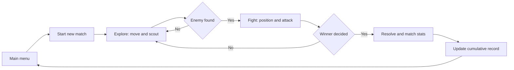
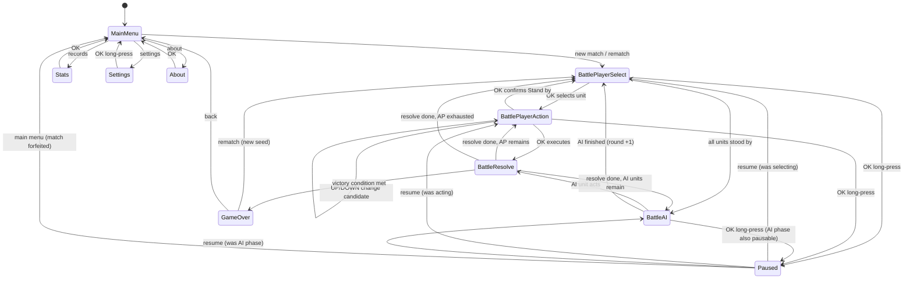

<p align="right">
  <a href="PRD_FOG_MARCH.zh_CN.md">简体中文</a> · <strong>English</strong>
</p>

# FOG MARCH PRD

> Document status: **Final (v1.1), reviewed** (review record in chapter 21)
> Product carrier: FoloToy AI Passport / ESP32-C3 / 240 × 320 LCD / three ADC buttons
> Target branch: `feature/fog-march`
> PRD version: v1.1
> Updated: 2026-09-24

---

## 1. Product overview

### 1.1 Product name

- Chinese name: Mi Wu San Guo ("Three Kingdoms in the Fog"; the exact glyphs live in the Chinese edition of this PRD)
- English UI name: `FOG MARCH`
- Internal feature name: `Three Kingdoms Fog Tactics`

The product name is finalized; see 19.1.

### 1.2 Positioning

FOG MARCH is an offline turn-based tactics game running on the FoloToy AI Passport. The player and the AI each command a small squad that explores, scouts, and fights on an 8 × 10 battlefield.

The core of the product is not numerical superiority but an **information game**: both sides see only what is inside their own vision, and everything else must be inferred. Victory depends on who reads the situation first and who hides better.

### 1.3 Core value

1. **Information asymmetry as strategy**: not seeing the opponent forces scouting, prediction, and probing. Depth comes from the information gap, not from complicated numbers.
2. **Short, interruptible sessions**: about 5 minutes per match; pick up and drop at any time, with no sunk cost when abandoning a match.
3. **An equally restricted AI**: the AI uses the same vision rules as the player and never reads information outside its own vision. The opponent is "an enemy general groping in the dark just like you", not an omniscient referee.
4. **Reliable offline play**: no phone, account, or network dependency; records are stored on the device.
5. **Three Kingdoms theme**: unit counters, generals, and objective capture fit the mechanics naturally.

### 1.4 Difference from existing upstream applications

Upstream `demo/` branches already contain a real-time action game (Tetris), rock paper scissors, a stopwatch, and eleven random-decision mini tools in `demo/funbox-11-in-1` (answer book, fortune sticks, dice, recommenders). **Turn-based tactics with fog of war has no implementation in this repository.** This application fills the "thinking, not millisecond reflexes" slot, and must redesign its UI per repository rules rather than reusing any existing demo page.

---

## 2. Background and design inputs

### 2.1 Hardware facts

The single source of truth for hardware capability is `components/bsp/include/bsp_pins.h`. Key constraints for this application:

| Item | Fact | Design impact |
| --- | --- | --- |
| Chip | ESP32-C3, **no PSRAM** | All memory is internal SRAM; free heap and largest contiguous block must be **measured on device** (the v0.1 figure of "about 400 KB" had no repository backing and was removed); do not cache large images or long audio |
| Flash | 8 MB, app partition 7.9 MB (`0x7f0000`, see `partitions.csv`) | Generous asset and font budget; the bottleneck is RAM, not Flash |
| Display | ST7789P3 240 × 320, RGB565, SPI2 @ 40 MHz | Partial refresh is the key to responsiveness; this game is turn-based, far below Tetris pressure |
| Buttons | `UP` / `DOWN` / `OK` share one GPIO0 ADC resistor ladder | **Four directions cannot be expressed directly**; input is the hardest design problem, see chapter 9 |
| Button events | Four kinds: `PRESS` / `CLICK` / `DOUBLE` / `LONG` | BSP capability fact; this application uses only three (double-click unregistered, see 9.4); zero-latency clicks are the feel baseline |
| Audio | ES8311, full-duplex I2S0, raw PCM | No MP3 decoding; sound effects use RTTTL text, nearly free in Flash |
| Battery | CW2017 SOC reading | An **optional capability**; a failed read must not block the game |
| Sleep | Light/deep sleep, RTC-timer wake only | No date-based streak or calendar statistics |

### 2.2 Upstream implementations worth consulting

Extract patterns from these branches; **do not merge them wholesale**:

| Branch | What to extract |
| --- | --- |
| `demo/funbox-11-in-1` | **Model layering paradigm**: pure-C state machine + semantic action abstraction, zero LVGL dependency |
| `demo/tetris-game` | Partial refresh (`lv_obj_invalidate_area`), frame-driven structure, microphone interaction and speaker-interference handling |
| `demo/cat-themed-pomodoro-timer` | PRD document paradigm, NVS blob with version + CRC, power-loss recovery strategy, resource lifecycle |
| `demo/claude-buddy-port` | Task communication and state reduction (not needed for a turn-based app yet) |

The key design in `funbox_model.c` is worth adopting directly:

```c
bool funbox_model_apply(funbox_model_t *model, funbox_action_t action);
```

Single entry point, pure C, no LVGL, returns "did the state change". The business layer never touches `BSP_BTN_*`. This decoupling is the foundation of testability.

### 2.3 The core input constraint

Of the three buttons, `UP` / `DOWN` express only two directions, while tactics need four-direction movement. This is the most important design constraint and the starting point of chapter 9.

**Rejected options**:

| Option | Rejection reason |
| --- | --- |
| Direction picker menu (`OK` pops up four arrows) | Three presses per move, hundreds of moves per match — far too heavy |
| `OK` toggles horizontal/vertical axis | Modal switching is disorienting and error-prone |
| Sequential scan of all 80 cells | Dozens of presses in the worst case to reach a target cell |

**Adopted option**: cyclic candidate selection, see 9.2.

---

## 3. Key assumptions and risks

**This chapter is the heart of the document. If these assumptions fail, the rest of development is pointless and must be validated first.**

### 3.1 Highest-priority assumption

> **Assumption H1: on an 8 × 10 board with both sides vision-limited, "fighting blind" is tense rather than tedious.**

This is the premise the whole product stands on. If the player mostly drifts meaninglessly in the fog, never finds the enemy, or feels it is "pure luck", then the combat system, the AI memory layer, and unit counters are all wasted.

**Validation**: complete the P0 build (battlefield + fog + vision + pure-searching AI, no counters) and play it on a real device. **This is the first milestone that must be hardware-verified; if it fails, return to design.**

### 3.2 Secondary assumptions

> **Assumption H2: the three-button "cyclic candidate" input stays acceptable across a 5-minute match.**

Failure shows up as "the player abandons precise operations because there are too many presses". Validation also relies on P0 playtesting. Fallbacks: fewer units (3 → 2) or bigger cells (8 × 10 → 6 × 8).

> **Assumption H3: under the same vision limits, the AI still plays "like an opponent" instead of random walking.**

Validation relies on the memory layer in 13.4. If the AI feels dull, raise its search weight (difficulty tiers, 13.5) rather than lifting the vision restriction.

### 3.3 Identified risks

| Risk | Level | Mitigation |
| --- | --- | --- |
| Fog drags the pace; a 5-minute match does not hold | High | Small map (80 cells), close starting positions, centered objective as a natural meeting point |
| Players discover the AI "cheats" its vision restriction | High | Architectural enforcement (13.3) + automated tests (17.5) |
| Missing CJK glyphs render as blank boxes | Medium | Early per-glyph verification of the 10.4 inventory + on-device acceptance; the built-in Source Han Sans subset itself **does not guarantee full coverage** |
| Cyclic candidates get tedious when many | Medium | AP budget keeps candidates under ~20; press-and-hold auto-repeat is P2 and needs a BSP HOLD event first (9.4) |
| A 3 px strength bar inside 26 px cells is unreadable on the real screen | Medium | 10.6 on-device measurement + two-level fallback (thicken to 4 px / numbers in the hint bar only) |
| Combat numbers are untuned by real players | Medium | All numbers centralized in one header for fast iteration |
| **Archer kiting**: no counterattack + range 2 + equal mobility means melee never catches an archer in open ground | Medium | Counter-trio: fire reveals position (8.5), objective-capture victory (8.6), terrain and map edges; verify in playtests |
| City triple benefit (+1 vision + damage reduction + victory condition) stacks too strong | Medium | Candidate nerfs listed in 19.2; tune after playtests |

---

## 4. Goals and non-goals

### 4.1 MVP goals

- Within **10 seconds** of entering the app, the user understands the basic "move cursor → execute action" loop.
- A match lasts **3–8 minutes**.
- The player clearly perceives "what I see" versus "where I guess he is" — fog is **information**, not **noise**.
- The AI shows observable searching and engagement behavior without reading anything outside its vision.
- After entering/leaving the battlefield 50 times: no leaks, crashes, or watchdog resets.

### 4.2 Success metrics

The device collects no cloud behavioral data; the MVP is accepted through on-device observable metrics:

- Key presses from first battlefield entry to first executed action ≤ 3.
- All AI-decision independence tests pass (see 17.5).
- After 20 consecutive matches, minimum free heap shows no sustained decline.
- Fog rendering correctness: visible / remembered / unexplored are never confused on the real screen.
- Match length falls in 10–30 rounds (below 10 is too fast, above 30 is dragging).

### 4.3 MVP non-goals

- Networking, Bluetooth matches, hot-seat multiplayer;
- In-match save/resume (rationale in 12.3);
- Large maps, multiple cities, economy, diplomacy, faction expansion;
- General progression, equipment, skill trees, card building;
- Story, dialogue, event systems;
- Touch, vibration, accelerometer interaction (hardware does not exist);
- Date-based streaks or calendar statistics (no reliable RTC);
- In-app OTA.

**Note on "Romance-of-Three-Kingdoms-style grand strategy"**: a full 3K game must present map, generals, resources, and diplomacy simultaneously. This screen fits about 300 text characters at most (240 ÷ 16 × 320 ÷ 16); one general stat table takes half the screen, and three-button deep menus cannot support it. **This product therefore converges to a single-battle tactical layer and drops the management layer.**

---

## 5. Target users and scenarios

### 5.1 Target users

- Players who like tactics/strategy games and will spend attention on "thinking one step ahead";
- Users who want a thoughtful match in fragments of time (commute, queue, before sleep);
- Users interested in, or at least not averse to, the Three Kingdoms theme;
- Users who do not want the game to depend on a phone, account, or network.

### 5.2 Core scenarios

1. The user opens the device in a spare moment, starts a new match from the main menu, and searches for the enemy in the fog.
2. On contact, the user exploits terrain and unit counters for local advantage.
3. Mid-match, the user must put the device away: long-press to exit and accept the loss (a single match is cheap).
4. After the match, the user checks the results page for outcome and cumulative records.
5. After losing several times in a row, the user wants a lower difficulty (tiers arrive with P2 scope, see chapter 18).

---

## 6. Product loop



The most important rule in the loop: **defeating the enemy is the only source of victory, and finding the enemy is the only premise of defeating it.** This turns scouting from an optional chore into the core gameplay — the reason the fog exists.

---

## 7. Information architecture

The MVP keeps navigation shallow; no deep menus on a three-button device.

```text
App start
└── Main menu
    ├── New match ───────> Battlefield
    │                        ├── Player phase
    │                        ├── AI phase
    │                        ├── Combat resolve (brief overlay)
    │                        └── Match end ──> Results page
    │                                           └── Back to main menu
    ├── Records
    ├── Settings (mute / difficulty; one-to-one with 12.1 persisted fields)
    └── About (name / version / MIT license / one-line intro)
```

Inside the battlefield, long-press `OK` opens the pause menu (continue / restart / main menu); no new navigation level.

The match-end page shows outcome (win / loss / draw), round count, and kills, with two fixed options: `Rematch` (same difficulty, immediate restart) and `Main menu`.

---

## 8. Core functional requirements

### 8.1 Battlefield and terrain

The battlefield is fixed at **8 columns × 10 rows = 80 cells**, portrait to match the 240 × 320 screen.

| Terrain | Passable | Line of sight | Effect |
| --- | --- | --- | --- |
| Plain | Yes | Clear | None |
| Mountain | Yes (1 AP) | **Blocks** | Unit on mountain takes × 0.67 damage |
| Forest | Yes (2 AP) | **Blocks** | A unit inside is hidden from enemies at Chebyshev distance ≥ 3; distance ≤ 2 (including the boundary distance 2, i.e. archer range) sees it normally |
| River | **No** | Does not block | Natural divider shaping march routes |
| City (objective) | Yes (1 AP) | Clear | +1 vision; unit on city takes × 0.67 damage |

Rules:

- The map is randomly generated at match start and must satisfy **connectivity** (any passable cell reaches any other);
- Generation uses a reproducible seed (`uint32_t`); the same seed must produce the same map, for testing and reproduction;
- **Single source of randomness**: all random behavior (map generation and first-move side) comes from a **self-contained deterministic PRNG** (e.g. splitmix32 / xoshiro128) driven by the map seed; calling `rand()`, `esp_random()`, or any platform-dependent source is **forbidden** — otherwise "same seed reproduces" cannot hold across platforms and the 17.5 seed tests cannot run on the host;
- Rivers must form strips and never create an uncrossable closed ring;
- Exactly one city is placed as the objective in the central area;
- Starting positions are fixed on opposite sides: player at column 0, (0, 3), (0, 4), (0, 5); enemy mirrored at column 7, (7, 3), (7, 4), (7, 5) (x = column, y = row). Opening distance is controlled (pace risk, 3.3); connectivity checks must cover all spawn cells;
- **One unit per cell**: at most 1 unit per cell regardless of side. Movement paths may pass through friendly units but not enemy units; the destination must be an unoccupied cell;
- One fixed built-in map (compile-time constant) as the fallback after repeated generation failures (chapter 14).

### 8.2 Units and classes

Three units per side. The player commands "our army"; the AI commands "the enemy".

| Class | Strength | Vision radius | Attack range | Counter |
| --- | ---: | ---: | ---: | --- |
| Spearman | 10 | 2 | 1 | Counters Cavalry |
| Cavalry | 8 | 2 | 1 | Counters Archer |
| Archer | 6 | 3 | 2 | Counters Spearman |
| General | 12 | 3 | 1 | No counter participation (neutral both ways, see rules) |

Counter cycle: **Spear → Cavalry → Archer → Spear**.

**Starting lineup (fixed 3 units per side): General + Spearman + Archer.** Cavalry is excluded — under the 3 AP cap its "mobility" role overlaps a normal unit; it is reserved for lineup expansion (4 v 4 or unit selection, decision 11 in 19.1). Lineups are mirrored for fairness; spear (melee shield), archer (ranged scout), general (observer and flag) cover three tactical roles.

**Vision/attack design invariant (must survive tuning)**: the three combat classes keep base vision radius = attack range + 1 (spear 2/1, cavalry 2/1, archer 3/2). Combined with 8.4 — attack 2 AP, move 1 AP, 3 AP per turn, so a turn allows at most "move 1 cell then attack" — this guarantees:

> **The distance at which a unit first sees an enemy is exactly the distance from which it can attack after one step.**

Encounters need no extra "approach rounds": contact means action, the pace is direct and predictable, and fog tension is not diluted by dragging. **Any change to a class's vision radius or attack range must re-verify this relation**, or the encounter rhythm breaks.

**The general is a deliberate exception**: vision 3, range 1 — one cell more than the rule. It cannot attack in the turn it first spots an enemy (closing 2 cells would consume all 3 AP). This is intentional: the general is an **observer and flag**, not a damage dealer; its value is earlier warning and the +1 damage it grants adjacent allies (8.5). Do not "fix" it to match the rule.

The invariant constrains **base vision** only; the "+1 on city" bonus in 8.3 is a deliberate situational modifier outside it.

Rules:

- Exactly one general per side; total annihilation or general death both end the match (8.6);
- **"General does not participate in counters" is two-way**: the general always resolves as neutral × 1.0 as attacker, and any unit attacking the general also resolves neutral regardless of counters. Its value is vision, the aura, and survival (12 strength = 4 neutral hits), not counter play;
- A unit at zero strength leaves the battlefield permanently;
- **Strength numbers are initial settings that must be retuned after on-device playtests**, centralized in one header for fast iteration.

### 8.3 Fog of war and vision

Three fog states, **which must be clearly distinguishable to the player**:

| State | Meaning | Rendering |
| --- | --- | --- |
| Visible | Currently seen by a friendly unit | Terrain and units in full color |
| Explored | Seen before, no current vision | Terrain in desaturated dark; **enemy units not shown** |
| Unexplored | Never seen | Pure black; nothing drawn |

Vision rules:

- Base vision is Chebyshev distance ≤ radius (radius 2 covers a 5 × 5 square);
- A unit on a city gets +1 vision radius;
- **Mountains and forests block sight** using ray casting (`Bresenham` or equivalent); blocked cells are not visible;
- **Ray endpoint rule**: blocking checks only the **intermediate cells** between observer and target; **the observer's own cell and the target cell's own terrain never block**. Otherwise mountain/forest cells could never be seen and marked "explored", and the forest rule in 8.1 ("visible at distance ≤ 2") could not be self-consistent (the forest cell itself is the target cell). Likewise, the mountain/forest an observer stands on does not block the observer's own vision;
- Forest conceals units inside it (see 8.1);
- Vision is recomputed immediately after any unit moves.

**Explored terrain is remembered forever; enemy unit information expires instantly.** This is the source of fog tension: the player remembers "there was an enemy general here three turns ago" but is not sure he is still there.

### 8.4 Turns and action points

- Strict turn order: all player units act → all AI units act → next round;
- Each unit receives **3 action points (AP)** per round;
- Moving 1 cell costs 1 AP (forest 2 AP). The candidate list shows **all reachable cells within the AP budget** (BFS shortest path, forest counted at 2 AP along the path; intermediate cells are independent candidates too — the player may stop after 1 cell and decide the next step). Paths may cross friendly units but not enemy units; the destination must be unoccupied (occupancy in 8.1);
- Attacking costs 2 AP, and **each unit attacks at most once per round**;
- A unit with exhausted AP automatically stands by;
- The player may deliberately stand a unit by with AP remaining: cycle the candidate list to the fixed trailing `Stand by` item and confirm (9.2, 9.4);
- When all player units stand by, the turn passes to the AI automatically;
- **First move is decided by the map seed** (reproducible): each match randomly starts with the player or the enemy. With no counterattacks the first mover is structurally favored; randomizing first move dilutes that advantage and keeps the AI from always moving second.

A unit's typical turn is therefore "step 1 cell and attack" or "move 3 cells for position" — a **trade-off between offense and mobility**.

### 8.5 Combat resolution

The attacker deals damage:

```text
damage = base attack × counter factor × target terrain reduction
```

| Factor | Value |
| --- | --- |
| Base attack | 3 |
| Counter (attacker counters target) | × 1.5 |
| Counter (attacker is countered) | × 0.67 |
| Neutral | × 1.0 |
| Mountain / city reduction | × 0.67 |
| Adjacent-general ally bonus | +1 damage |

**Order of operations and rounding** (strictly in this order, or the same position yields different results):

```text
Step 1  product = floor(base attack × counter factor × terrain reduction)
Step 2  product = max(product, 1)                         // minimum damage floor
Step 3  final   = product + adjacent-general ally bonus
```

- The product is **floored**; the additive bonus applies **after** multiplication;
- The minimum of 1 guarantees every attack shaves at least 1, preventing "neither side can hurt the other" stalemates;
- The general's bonus is a **flat +1 that never joins multiplication**. Applied before, it would become `(3 + 1) × 1.5 = 6` when countering, breaking its role as a stable tactical gain.

All damage tiers follow; this table is the shared basis for player mental math and the UI hint bar:

| Case | Computation | Damage |
| --- | --- | --- |
| Neutral, no terrain reduction | `3 × 1.0` | 3 |
| Neutral + terrain reduction | `3 × 1.0 × 0.67` | 2 |
| Countering | `3 × 1.5` | 4 |
| Countering + terrain reduction | `3 × 1.5 × 0.67` | 3 |
| Countered | `3 × 0.67` | 2 |
| Countered + terrain reduction | `3 × 0.67 × 0.67` | 1 |
| Countering + adjacent-general bonus | `4 + 1` | 5 |

Remaining rules:

- Combat is **fully deterministic** — no crits, no dodges, no randomness — for reproducibility and testability;
- Results appear in a brief overlay (damage number + strength-bar change) for about 800 ms;
- Archer range is 2 and may attack from a non-adjacent cell; all other classes have range 1 and must be adjacent;
- **Attacking requires line of sight**: the target must be inside the attacker's vision and the attack path unblocked by mountain/forest (the same ray test as 8.3, including the endpoint rule). Archers cannot shoot over mountains;
- **"Adjacent" for the general's bonus** is Chebyshev distance 1 (all 8 cells, consistent with vision); the general's own attacks never receive its own bonus (it only buffs adjacent allies);
- **Muzzle flash**: the instant a unit attacks, its cell is revealed to the entire enemy side ("arrows have firelight") — ignoring vision and blocking, it is written into the enemy's last-known-position memory and rendered per the ghost rule in 10.3 until the enemy gains a newer observation. This is the core check on archer kiting: every shot exposes position once;
- When attacking an adjacent target that survives, **the target does not counterattack** (avoids extra state complexity; P1 evaluation item).

### 8.6 Victory conditions

**Victory** (any one):

1. Destroy all enemy units;
2. Destroy the enemy general;
3. Hold the objective with a friendly unit for **3 consecutive full rounds**. One "full round" = both the player phase and the enemy phase ending; the check runs at each full-round boundary — if a friendly unit stands on the objective and no enemy unit does, count +1, otherwise reset. "Eviction" = an enemy unit steps onto the objective, or the occupying unit is destroyed / leaves. One-unit-per-cell (8.1) guarantees both sides can never hold the objective simultaneously.

**Defeat**:

1. All friendly units destroyed;
2. The friendly general destroyed;
3. The enemy holds the objective for 3 consecutive full rounds.

**Draw**: at the round cap (default 40) with neither side meeting a victory condition.

Multiple conditions give the losing side a comeback path (objective theft) and avoid a monotonic "more units wins" endgame.

### 8.7 AI opponent

The AI uses **exactly the same** vision rules as the player and, at the code level, reads nothing outside its vision. Three-layer structure in chapter 13.

### 8.8 Out-of-match statistics

Updated after each match and shown on the records page:

| Field | Meaning |
| --- | --- |
| Total matches | Cumulative completed matches |
| Wins / losses / draws | Counts |
| Longest win streak | Historical best |
| Kills | Cumulative enemy units destroyed |
| Fastest win | Fewest rounds to a win |

**No date-based statistics** (no reliable RTC, 2.1).

### 8.9 Sound and mute

- Short sound effects for move, attack, taking damage, unit death, and match resolution;
- Effects use **RTTTL text format** — no audio files, negligible Flash. The repository has **no existing RTTTL dependency**: the parser and square-wave PCM synthesis are self-written pure C (no ESP-IDF/LVGL dependency) and covered by host tests;
- Mute toggles in settings and persists;
- If ES8311 initialization fails, **only sound effects are disabled** — never game logic or rendering;
- Audio playback runs in its own task and must not block button callbacks or the LVGL task.

---

## 9. Three-button interaction

### 9.1 Gesture assignment

| Gesture | Use |
| --- | --- |
| `UP` / `DOWN` click | Cycle candidates or menu items |
| `OK` click | Execute the highlighted item |
| `OK` long-press | Go back one level / open the pause menu |
| `UP` / `DOWN` long-press | Reserved; P2 candidate auto-repeat, needs a BSP extension (9.4) |

**None of the three buttons registers double-click**; rationale in 9.4.

### 9.2 Cyclic candidate selection (the core scheme)

This is the key mechanism solving "three buttons cannot express four directions".

When a friendly unit is selected, all currently **legal target cells of its actions** form an ordered candidate list (reachability per 8.4):

1. **Sort order**: by action type first (movable cells → attackable targets), then by fixed bearing ring (up, right, down, left), by distance to the unit ascending within one bearing, then y, x;
2. **Fixed tail**: after sorting, append one `Stand by` pseudo-item. It maps to no cell, does not participate in sorting, and is always last;
3. `UP` selects the previous candidate, `DOWN` the next, **wrapping around** (pressing `DOWN` past `Stand by` returns to the first movable cell);
4. The current candidate is highlighted with a border, and **every other candidate shows a faded 1 px border (blue for moves, orange for attacks) so the whole action range reads at a glance**; the bottom hint bar shows the action's type and cost; **attack candidates must also show expected damage and target remaining strength** (hint-bar rules in 10.6). On `Stand by`, the bar shows `Stand by — end this unit's action`;
5. `OK` click executes the highlighted candidate; if it is `Stand by`, the unit ends its action and control returns to unit selection. This is the **only** way to deliberately stand by with AP remaining (why not double-click: 9.4);
6. If the list contains only `Stand by`, or is empty (AP exhausted or surrounded), the unit stands by automatically;
7. **Candidate list panel**: during the action phase a semi-transparent panel overlays the map area, listing every candidate row by row (`Move (x,y) nAP` / `Attack enemy <class> dmg n` / `Stand by`). The current candidate carries a `>` prefix and a type-colored background; the highlight and scroll window follow `UP`/`DOWN`; after `OK` executes, the panel refreshes with the state. When the list exceeds 14 rows, a sliding window keeps the current item centered. The panel is a second readout next to the hint bar, addressing the playtest feedback that move/attack/stand-by switches were hard to notice.

Sorting must be stable: **repeated `UP`/`DOWN` in the same state must produce a fully predictable order**; no random factor may affect ordering.

H2 validation outcome (on-device playtest, 2026-09-24): the original distance-first order broke the sense of direction when holding `DOWN` — the highlight jumped between the four bearings and movement felt random. The order was adjusted to the bearing ring per this section's contingency: holding `DOWN` now walks outward along one bearing before moving to the next. A faded range border for all candidates was added alongside (see item 4).

### 9.3 Full interaction table

| Page / state | `UP` | `DOWN` | `OK` click | `OK` long-press |
| --- | --- | --- | --- | --- |
| Main menu | Previous | Next | Enter | No action |
| Battle · player phase · select | Previous unit | Next unit | Select and enter action | Pause menu |
| Battle · player phase · action | Previous candidate | Next candidate | Execute highlight (incl. `Stand by`) | Pause menu |
| Battle · AI phase | Speed up animation | Speed up animation | No action | Pause menu |
| Combat resolve overlay | No action | No action | Skip wait | No action |
| Pause menu | Previous | Next | Choose | Close menu |
| Match end | Previous | Next | Choose | Main menu |
| Records page | No action | No action | Back | Main menu |
| Settings | Previous | Next | Toggle item | Main menu |
| About | No action | No action | Back | Main menu |

Buttons marked "no action" must not play an error sound or change state.

**Button callbacks must not block** (`bsp_button.h` states callbacks run on the shared `esp_timer` task). All game logic runs in the main loop or LVGL timers; callbacks only enqueue.

### 9.4 Why none of the three buttons uses double-click

**Conclusion: `UP` / `DOWN` / `OK` register no double-click.**

This is a causal chain, not a preference:

1. To distinguish single from double clicks, the driver **must wait out the double-click window** before deciding a press is a single click rather than the first half of a double;
2. Therefore **any button with double-click registered carries that window as inherent click latency**;
3. All three buttons' clicks here **carry high-frequency operations** — `UP`/`DOWN` drive candidate cycling (hundreds of presses per match), `OK` executes. Latency on any of them directly damages feel;
4. So **moving double-click to another button cannot dodge the problem**; double-click must be dropped entirely.

Long-press is unaffected: it is an **independently timed** path, settling as a click on release, without delaying click response. `OK` long-press for the pause menu is therefore safe.

**Replacement**: the "deliberate stand by / hand over control" duty double-click once carried is handled by the fixed `Stand by` tail item (9.2 items 2 and 5) — zero new buttons, zero latency.

**Required BSP changes (two)**:

1. **Remove double-click registration (required for this project)**: `register_callbacks()` in `components/bsp/src/bsp_button.c` currently **registers `BUTTON_DOUBLE_CLICK`** (verified against source at review; `bsp_button.c:121`) — meaning that on stock BSP, clicks inherently wait out the double-click window. Remove that registration so the three buttons keep only `PRESS_DOWN` / `SINGLE_CLICK` / `LONG_PRESS_START`. The `BSP_BTN_DOUBLE` entry in the `bsp_btn_ev_t` enum in `bsp_button.h` **stays untouched** for other applications; this app simply never receives the event.
2. **Register `BUTTON_LONG_PRESS_HOLD` (P2)**: `LONG_PRESS_START` reports once at hold start and **does not repeat**, which cannot drive "candidate auto-repeat". The new event type is backward compatible for existing callers and does not affect current `main` demos.

> **Must verify during implementation**: "clicks have no latency when no double-click callback is registered" is an inference from the common implementation of `espressif/button` 4.2.0 (the component source is not vendored, so static review cannot confirm it). If unregistering double-click does remove the latency, this trade-off holds; if the component still imposes a wait window with only single-click registered, the fallback is the `PRESS_DOWN` event with instant visual feedback (highlight and sound on press-down) to mask the delay.

---

## 10. UI and visual specification

### 10.1 Screen specification

- Resolution 240 × 320, portrait;
- RGB565 color;
- Style: pixel art, high contrast, dark background;
- UI language: Chinese (font plan in 10.4);
- Minimum body text: 14 px equivalent.

### 10.2 Battlefield page layout

```text
┌────────────────────────┐ 0
│ Round 07  Us 3  AI 3  75%│ Status bar 28 px (battery at right)
├────────────────────────┤ 28
│                        │
│                        │
│    8 × 10 battlefield   │ Battlefield 260 px
│    26 px per cell       │ (10 rows × 26)
│                        │
│                        │
├────────────────────────┤ 288
│ Move 1AP     Spear 8/10 │ Hint bar 32 px
└────────────────────────┘ 320
```

Width check: 8 × 26 = 208, with 16 px margins each side, total 240 ✓
Height check: 28 + 260 + 32 = 320 ✓

The hint-bar content above is illustrative: it follows the highlighted object; in-cell strength bars and numeric display are specified in 10.6.

During the enemy phase the status bar replaces the strength counts with `AI acting` as a clear phase indicator. UI copy never uses uncommon symbols (CJK subset coverage is doubtful, 10.4); unit ownership is shown by color. (The shipped UI text itself is Chinese; see the Chinese edition for exact strings.)

**Battery display (repository default invariant)**: per the runtime invariants in `docs/development/ai-guide.md`, an application UI shows the battery level by default in the **top-right corner** (read via `bsp_battery_soc()`). This app puts it at the right end of the status bar: SOC percent normally; when the read fails (-1), **the slot stays blank — no number is drawn** — and the game is never blocked (consistent with chapter 14).

### 10.3 Fog rendering

- The three fog states must differ **clearly in saturation and brightness**, not by subtle border differences;
- Unexplored is pure black with no terrain detail;
- Explored uses desaturated terrain colors, clearly distinct from in-vision;
- Enemy units are drawn only inside current vision; **exception (muzzle flash, 8.5)**: a unit that just attacked and has not been re-observed is drawn as a dark ghost at its last known position;
- AI unit movement **outside** player vision produces no visual change — no trails, no position hints, or the fog is broken. AI units appear the instant they enter vision and vanish the instant they leave;
- Rendering uses **partial refresh**: on a unit move, redraw only the two affected cells and vision-changed cells, not the whole screen. See `lv_obj_invalidate_area()` usage in `demo/tetris-game`.

### 10.4 Chinese font plan

**This is the third-biggest technical risk (3.3).** The default Montserrat 14 / 20 **contains no CJK glyphs**; correct UTF-8 and a successful build **do not** mean Chinese will display. The Source Han Sans SC subset built into LVGL 9.5.0 is **itself a subset that does not guarantee coverage of all needed characters** (per `docs/development/engineering/lvgl-chinese-fonts.md`); per-glyph verification is mandatory.

**Plan A (preferred)**: enable the built-in Source Han Sans SC CJK font.

```text
CONFIG_LV_TXT_ENC_UTF8=y
CONFIG_LV_USE_FONT_PLACEHOLDER=y
CONFIG_LV_FONT_SOURCE_HAN_SANS_SC_16_CJK=y
```

These Kconfig names were verified against the repository's pinned LVGL 9.5.0 and the fonts engineering doc. Settings go into this application's tracked `sdkconfig.defaults`; after building, verify the generated `sdkconfig` (the firmware gate builds from an isolated configuration).

**Glyph coverage must be checked early (not before release).** The application's required character inventory is maintained in the Chinese edition of this PRD (section 10.4) and must be verified glyph by glyph via `lv_font_get_glyph_dsc()` code-point checks, not by eyeballing.

**Missing-glyph fallback (in priority order)**:

1. If ≤ 5 glyphs are missing, reword with synonyms;
2. If the built-in subset is insufficient, generate an LVGL subset font containing only the inventory as an independent source file (Plan B);
3. If the font workload explodes, fall back to an English UI (name defined in 1.1).

**Plans A and B both require on-device acceptance**: glyph coverage, actual widget fonts, and real-screen rendering (per `docs/development/engineering/lvgl-chinese-fonts.md`).

### 10.5 Color guidance

| Use | Suggested color | Note |
| --- | --- | --- |
| Friendly units | Blue family | Distinct from terrain |
| Enemy units | Red family | Only inside vision |
| Low-strength warning (≤ 3 left) | Warning orange | Overrides the unit strength-bar fill, 10.6 |
| Current cursor | Highlight outline | Strong contrast with unit base color |
| Movable candidates | Cool translucent outline | |
| Attackable candidates | Warm translucent outline | |
| Mountain | Brown-gray | |
| Forest | Dark green | |
| River | Deep blue | |
| City | Ochre | |

Color definitions are centralized; no scattered hard-coded values in rendering code. The table above is realized by the 10.7 asset generator: terrain and unit palettes live in `tools/gen_fog_march_assets.py`; changing colors means editing the generator palette and regenerating, never redefining colors in rendering code.

### 10.6 Strength display

**This section fills a real gap**: 10.2 only required the hint bar to show the selected unit's strength, but attack decisions **must reveal how much strength the enemy has left**, or the 8.4 AP trade-offs and 8.5 damage math are unusable.

Constraint: a 26 px cell cannot fit any digits (CJK font size is 16 px; two characters take half the width). Strength is therefore **layered** — an absolute-scale graphic inside the cell, exact numbers in the hint bar.

**In-cell strength bar**

Horizontally centered, inset 2 px from the cell bottom, fixed size **22 × 3 px**:

| Part | Length |
| --- | --- |
| Slot (dark gray) | `floor(full strength / 12 × 22)` px |
| Fill | `floor(current strength / 12 × 22)` px |

**Drawn on an absolute strength scale, not a ratio scale.** The key decision, because:

- On a ratio bar, "an archer at 6/6" and "a general at 6/12" look identical (both half), yet mean opposite things — one is a full-strength threat, the other a cripple;
- Combat deals fixed damage; life-or-death takes 2–4 hits. The real question is "**does this hit break them**", an absolute question, not a ratio;
- On an absolute scale every unit on screen compares directly, with one memorable rule: **fill equals slot length = full strength**.

Boundary rules:

- With strength > 0, the fill is **at least 1 px** (`1 / 12 × 22 = 1.83 → 1`) so cripples stay visible;
- No bar after death;
- Explored-area enemy units are not drawn (10.3); neither is their bar.

Colors follow 10.5: friendly fill cyan-blue, enemy fill red. Plus a **low-strength warning**: at ≤ 3 remaining the fill turns warning orange — 3 is exactly the base attack, i.e. "one more hit kills".

**Exact numbers in the hint bar**

The 32 px, full-width 240 px bar fits about 15 characters at 16 px. Content follows the highlight:

| Highlighted object | Hint bar content | Example (Chinese UI) |
| --- | --- | --- |
| Friendly unit (select phase) | Class + current / full | `Spearman 8/10` |
| Movable candidate | AP cost | `Move 1AP` |
| Attackable candidate | AP cost + **expected damage** + target class and strength | `Attack 2AP Dmg4 Enemy archer 6/6` |

**Attack candidates must show expected damage and target remaining strength together.** This is the only basis for "does this hit break them"; showing only `Attack 2AP` forces the player to memorize HP, which is information being effectively unavailable. The hint bar refreshes while cycling `UP`/`DOWN` — cycling is already fully predictable, so the follow is free.

Expected damage must **reuse the 8.5 resolver** — never re-implement it in the render layer, or a rounding change desynchronizes UI hints from actual results.

**Field truncation priority**: on overflow keep, in order, `AP cost` → `expected damage` → `target strength`; class names may shrink to one character.

**On-device verification item**: whether a 3 px bar is legible on the real 240 × 320 screen **cannot be settled on paper — no guessing**; measure during P0 playtests. If unclear, degrade in order: ① thicken to 4 px; ② drop the in-cell bar and keep numbers in the hint bar only.

### 10.7 Asset strategy (assets first)

**Decision**: art assets land before P0 development (user decision, 2026-09-24). Battlefield terrain and units use pixel sprites instead of plain color blocks; dynamic elements — strength bars, candidate outlines, fog ghosts — stay procedurally drawn (sprites cannot cover them); ghosts reuse the unit sprite at runtime opacity.

**Inventory and budget**: 18 sprites at 26 × 26 — 5 terrains × visible/dim variants (in-vision / explored fog) + 4 classes × blue and red sides, 29,744 bytes total. Blobs are embedded via CMake `EMBED_FILES` and drawn straight from Flash: no heap cost, negligible against the 7.9 MB partition budget.

**Formats**: `.rgb565` (opaque terrain, little-endian RGB565) and `.rgb565a8` (units, RGB565 plane + A8 alpha plane), matching LVGL 9's `LV_COLOR_FORMAT_RGB565` / `LV_COLOR_FORMAT_RGB565A8`. The pipeline follows the `demo/rock-paper-scissors` precedent (`tools/gen_rps_assets.py` → `main/assets/` → EMBED_FILES → runtime `lv_image_dsc_t` wrapper).

**Source of truth and regeneration**: the only source of truth is the ASCII pixel maps and palettes inside `tools/gen_fog_march_assets.py` (original art authored in this repository, MIT license). After editing, rerun the generator and commit the refreshed outputs together with the script; `tests/test_fog_assets.py` verifies the committed data matches a clean regeneration **byte for byte** and is wired into `tools/validate.sh --static`. Previews live in `assets/fog-march/preview/` (including a contact sheet) for visual review only — they are not edit sources.

**Placement**: firmware blobs in `main/assets/fog_*`; documentation and previews in `assets/fog-march/` (registered in that directory's README and in `assets/README.md`).

**On-device acceptance**: color fidelity on the RGB565 panel, distinguishability of the three fog states (including the terrain dim variants), and instant blue/red side recognition are covered by 17.4.

---

## 11. State machine



**Pause must remember its origin state**: `resume` returns to the pre-pause state (select / action / AI phase), never a fixed destination — otherwise the AI phase is swallowed by pausing.

State transitions must be **pure functions** taking no LVGL or ESP-IDF types, for host-test coverage (15.1).

---

## 12. Data and persistence

### 12.1 Persisted content

Only **out-of-match statistics and settings** persist, as one NVS blob with version and CRC.

| Field | Type | Meaning |
| --- | --- | --- |
| schema_version | uint16 | Data structure version |
| total_matches | uint32 | Cumulative matches |
| wins / losses / draws | uint32 | Counts |
| longest_win_streak | uint32 | Historical best |
| current_win_streak | uint32 | Current streak (maintains the best) |
| total_kills | uint32 | Cumulative kills |
| fastest_win_rounds | uint16 | Fewest rounds to a win; 0 = none |
| difficulty | uint8 | Difficulty tier |
| muted | bool | Mute state |
| crc | uint32 | Integrity check |

### 12.2 Save timing

- At match end (one transaction updates all record fields);
- On difficulty or mute changes;
- Never per-round.

### 12.3 Why in-match progress is not saved

A **deliberate decision**, not an omission:

1. A match is ~5 minutes; restarting is cheaper than the cognitive cost of resuming;
2. Serializing full battle state (map, units, AP, vision, AI belief map) would bloat the state surface and bug risk;
3. The "pick up and drop" goal is a **cheap single match**, not **suspendability**.

If playtests prove this wrong, re-evaluate at P2 (decision 4 in 19.1).

### 12.4 Data anomalies

- On CRC failure, **reset to defaults and show a one-time `save reset` notice** (a failed CRC means the whole blob is untrusted; no partial recovery); on version mismatch, run an explicit migration or a safe reset — never crash;
- When NVS is unavailable, run in **temporary mode**: records are not promised across reboots, the UI shows `save unavailable`, and the game remains fully playable;
- Version migration must be explicit or safely reset, never crash.

---

## 13. AI opponent design

This chapter is the technical core. **AI fairness is the foundation of product credibility.**

### 13.1 Three layers

```text
Perception    reads only own-vision information → observation_t
        ↓
Belief        maintains an enemy-position probability map → belief[8][10]
        ↓
Decision      chooses actions from observation + belief
```

### 13.2 Why layering is mandatory

A naive tactics AI is **omniscient**: it reads the whole game state and solves for the optimum. Here it would "run precisely at the player through the fog". Once the player notices, the fog mechanic loses meaning and the core value collapses.

The AI must therefore acquire information **only through `observation_t`**.

### 13.3 Architectural enforcement (critical)

```c
typedef struct {
    uint8_t terrain_known[8][10];   /* terrain the AI has observed; unobserved = unknown */
    uint8_t visible[8][10];         /* current vision (all own units combined) */
    uint8_t enemy_known[8][10];     /* cells with confirmed enemies (in vision + muzzle flash, 8.5) */
    uint8_t last_seen_round[8][10]; /* last round each cell confirmed an enemy; 0 = never */
    uint8_t objective_x, objective_y; /* objective position (map center; usable once explored) */
    uint8_t objective_owner;        /* objective owner: 0 none / 1 us / 2 enemy */
    uint16_t round;                 /* current round (belief decay basis) */
    fog_unit_t own[3];              /* own units: position, strength, AP */
} fog_observation_t;

fog_action_t fog_ai_decide(const fog_observation_t *obs, const fog_ai_memory_t *mem);
```

**The decision function accepts only `obs` and `mem`, never the real battlefield state.** This is a compile-time guarantee, not a discipline note. The AI decides through this interface from P0 on, with `mem` an empty implementation (no belief map) — no exceptions, no shortcuts, or P1 would force an architecture refactor.

### 13.4 Memory layer (belief map)

The AI maintains `belief[8][10]`, each cell holding the **expected number of enemy units** (range [0, 3], fractional allowed) — the enemy has 3 units, a scalar probability field cannot express a multi-unit distribution, and expected counts read more directly: the decision layer uses it to judge "which direction is worth searching". **The sum always equals the number of living enemy units** (conservation), which anchors normalization.

Update rules:

1. **Enemy observed** (in vision, or muzzle flash, 8.5): the cell becomes certain and `last_seen_round` is recorded;
2. **Observed with no enemy**: probability zeroed;
3. **Outside vision**: decays by round count and **diffuses** to neighbors — enemies move. The diffusion model is a fixed deterministic formula with no randomness, for reproducibility;
4. Normalize to conserve the sum.

`last_seen_round` is the source of tension: for an enemy seen 3 rounds ago, the AI thinks "probably still nearby" with lower confidence. The AI behaves **like an experienced human** — groping toward where you last appeared.

### 13.5 Decision layer

A utility function chooses among:

| Behavior | Trigger | Weight factors |
| --- | --- | --- |
| Engage | Enemy in vision | Counter relations, target strength, own strength |
| Search | No visible enemy | Distance to high-belief regions |
| Take objective | Objective unowned or contestable | Distance, current round |
| Retreat | Own strength low with a visible strong enemy | Strength ratio, escape routes |

Difficulty tiers adjust **utility weights and belief decay speed**, **never the vision restriction**:

| Tier | Traits |
| --- | --- |
| Easy | Low search tendency, conservative engagement, fast belief decay (forgets quickly) |
| Normal | Default weights |
| Hard | High search tendency, actively takes the objective, slow decay (long memory) |

### 13.6 Performance constraints

- A decision must complete within **50 ms** or the AI phase visibly stutters;
- The candidate space is "3 units × ~20 cells" — tiny, no pruning needed;
- The belief map is 80 bytes, no memory pressure;
- Decisions run as a separate step, **never inside button callbacks**.

---

## 14. Exceptions and degradation

| Exception | Degradation |
| --- | --- |
| ES8311 init failure | Disable sound only; logic and rendering unaffected |
| CW2017 read failure | Battery slot in the status bar stays blank (no number); never blocks the game |
| NVS unavailable | Temporary mode; show `save unavailable` |
| NVS data corrupt | Reset statistics with a one-time notice |
| LVGL lock timeout | Skip this frame; never block game logic |
| Map generation failure (connectivity) | Retry with backup seeds, at most 3; then the built-in fixed map |

**No degradation may make the game unplayable.**

---

## 15. Technical and performance constraints

### 15.1 Architecture placement

Follow the repository boundary: reusable board logic in `components/bsp`; pages, state machines, AI, and app tasks in `main`.

**Two BSP changes, both listed in 9.4. The P0-required one** removes the `BUTTON_DOUBLE_CLICK` registration from `register_callbacks()` in `components/bsp/src/bsp_button.c`, so three-button clicks stop waiting out the double-click window. It is a **precondition for this project** (otherwise 9.1's zero-latency clicks are impossible) and is board-level input behavior, not application logic. **The other is a P2 dependency** (register `BUTTON_LONG_PRESS_HOLD` for candidate auto-repeat), not needed for P0. Neither changes the **public BSP API** — the `BSP_BTN_DOUBLE` enum entry stays for other applications. No other BSP file is modified.

**Blast radius of removing double-click (verified at review)**: no `main/` baseline demo page uses `BSP_BTN_DOUBLE` (repository-wide grep, zero hits); the only affected existing test is `tests/test_bsp_button.c` — its fault-injection loop assumes `BSP_BTN_COUNT * 4` registrations per pass (4 events per button) and must change to 3.

**Build impact**: this branch rewrites `main/main.c` and drops the baseline `demo_*.c` test pages from the `main/CMakeLists.txt` source list (the UI-redesign rule forbids the test shell anyway); BSP and tests directories are untouched.

Suggested modules:

```text
main/fog_app.c/h     application lifecycle (enter/exit/key/start/stop); UI-redesign entry
main/fog_model.c/h   pure logic: map generation, units, rounds, AP, vision, combat, victory
main/fog_ai.c/h      AI: perception, memory, decision
main/fog_view.c/h    LVGL rendering (partial refresh)
main/fog_store.c/h   NVS out-of-match statistics
main/fog_audio.c/h   RTTTL sound effects
main/main.c          entry point (rewritten; launches this app, not the BSP test menu)
```

`fog_model.c` and `fog_ai.c` must **include no LVGL or ESP-IDF headers** (stubbed `esp_timer` etc. allowed only in tests) so host tests run.

### 15.2 Threads and resources

- Button callbacks run on the shared `esp_timer` task: **enqueue only, never block**;
- Hold `bsp_lvgl_lock()` when touching LVGL objects outside the LVGL task;
- Audio playback lives in its own task;
- Before exiting, stop every task, timer, and callback that can reach the UI (repository demo lifecycle rule);
- **Memory budget is measured on device** (free heap and largest block, per the hardware guide); the baseline `sdkconfig.defaults` enables NimBLE, this application uses no Bluetooth, so the branch should disable the `CONFIG_BT*` options to reclaim RAM (afterward confirm `demo_ble.c` left the build per 15.1).

### 15.3 Performance targets

| Metric | Target |
| --- | --- |
| Single AI decision | ≤ 50 ms |
| Visible update after a unit move | ≤ 100 ms |
| First full battlefield paint | ≤ 300 ms |
| Minimum free heap after 20 matches | No sustained decline |
| App partition usage | Record measured value (expected far below the 7.9 MB cap) |

### 15.4 UI redesign compliance

Per the mandatory rule in `AGENTS.md`, this application **must design and implement its own UI**:

- No reuse of the `main/` demo test menu, pages, or visual shell;
- Renaming, recoloring, or adding a feature page to that shell **does not count** as redesign;
- BSP APIs, ordinary LVGL widgets, and non-UI logic are reusable; pure computation helpers such as `ui_pixel_math` are reusable, but `ui_pixel_screen_create()` / `ui_pixel_panel_create()` are part of the baseline test shell (explicitly forbidden for derivative applications by the runtime invariants in `docs/development/ai-guide.md`) and **must not be called**;
- One completion criterion: startup and navigation **never enter** the BSP baseline test UI.

---

## 16. Logging and diagnosability

- `esp_log` with levels; normal matches do not spam;
- Key events: map seed, victory-condition outcomes, AI decision summaries (behavior type and target cell);
- **Logging the map seed is the key to debugging**: any match reproduces from its seed (provided 8.1's deterministic-PRNG constraint holds);
- No player-privacy data or unsanitized system info;
- A compile-time switch dumps AI belief-map snapshots for behavior debugging (off in release builds).

---

## 17. Acceptance criteria

### 17.1 Functional

- [ ] Each match generates a random map with connectivity verified: any passable cell reaches any other.
- [ ] The same seed produces the same map.
- [ ] The three fog states are clearly distinguishable on the real screen.
- [ ] Enemy units render only in current vision and vanish immediately upon leaving it.
- [ ] Explored terrain stays visible permanently; it never turns black again.
- [ ] Mountains and forests block sight correctly (per the 8.3 endpoint rule: intermediate cells only).
- [ ] Forest conceals its occupant from enemies beyond distance 2.
- [ ] Units receive 3 AP per round; movement and attack costs are correct.
- [ ] Each unit attacks at most once per round.
- [ ] Candidate order is stable and predictable; repeated `UP`/`DOWN` yields the same sequence.
- [ ] In-cell strength bars use the absolute scale; fill = slot means full; ≥ 1 px fill whenever strength > 0.
- [ ] Attack candidates show AP cost, expected damage, and target remaining strength; expected damage matches actual resolution.
- [ ] Combat resolution follows counter and terrain factors and is deterministic.
- [ ] All three victory conditions are reachable; the draw triggers at round 40.
- [ ] Long-press `OK` reliably opens the pause menu and restores the exact pre-pause state.
- [ ] The records page matches cumulative statistics.
- [ ] Mute persists across reboots; with audio failed, the game is fully playable.

### 17.2 Balance and pacing

- [ ] Match duration lands in 3–8 minutes.
- [ ] Match length lands in 10–30 rounds.
- [ ] Average round of first enemy contact ≤ 8 (ensures mid-game fighting).
- [ ] AI win rate differs perceptibly across the three difficulties.

### 17.3 Recovery and exceptions

- [ ] Leaving via the pause menu mid-match and starting a new match causes no crash or leak.
- [ ] NVS version mismatch triggers an explicit migration or safe reset.
- [ ] With NVS unavailable, the game runs in temporary mode.
- [ ] After three failed connectivity checks, generation falls back to backup seeds / the fixed map.
- [ ] With audio initialization failed, the game is fully playable.

### 17.4 UI and hardware

- [ ] 240 × 320 without clipping, overlap, scrollbars, or color byte-order issues.
- [ ] Status bar, battlefield, and hint bar never occlude each other.
- [ ] Battery display and degradation match 10.2 (blank slot on read failure, no number drawn).
- [ ] Units, cursor, and candidate highlights are clearly contrasted on the real screen.
- [ ] The 3 px strength bar in 26 px cells is legible; if not, the 10.6 fallback was applied.
- [ ] The battlefield renders with the 10.7 sprites; the explored fog state uses the terrain dim variants; blue/red sides are recognizable at a glance on the real screen.
- [ ] `CLICK` / `LONG` never mis-trigger each other; no double-click registered; clicks show no perceptible latency.
- [ ] **Chinese glyph coverage verified character by character; no blank boxes on the real screen.**
- [ ] After 50 battlefield enter/exit cycles, minimum heap shows no sustained decline.
- [ ] Startup and navigation never enter the BSP baseline test UI.

### 17.5 Automation and build

- [ ] Map generation tests: seed reproducibility, connectivity checks, rivers never close a ring.
- [ ] Vision tests: radius, mountain/forest blocking, city bonus, edge cells, **the ray endpoint rule (observer and target cells never block)**.
- [ ] Round tests: AP costs, attack limits, stand-by, turn handover.
- [ ] Candidate-list tests: sort stability (identical order when rebuilt in the same state), `Stand by` always last, wrap-around cycling.
- [ ] Combat tests: three counter relations, terrain reduction, general bonus, strength reaching zero, **rounding (floor, minimum 1) and the bonus-after-multiplication order**.
- [ ] Victory tests: three conditions, the draw, priority when several hold simultaneously.
- [ ] **AI fairness (critical)**: with a fixed `observation_t` input, `fog_ai_decide()` returns identical results regardless of real enemy positions.
- [ ] AI tests cover belief-map update, decay, diffusion, and normalization.
- [ ] Persistence tests cover CRC errors, version migration, and statistic accumulation.
- [ ] ESP-IDF 5.5.3 `idf.py build` passes with no new warnings.
- [ ] `./tools/validate.sh --static` repository checks and host tests pass (including the updated `tests/test_bsp_button.c` after the BSP button change).
- [ ] Record final app partition usage, static RAM, and on-device minimum free heap.
- [ ] Sprites regenerate byte-identically from `tools/gen_fog_march_assets.py` (`tests/test_fog_assets.py`, wired into validate.sh).

---

## 18. Development priorities

### P0: first playable (must be completed and hardware-verified first)

The goal is **validating assumption H1** (3.1), not building the full game.

- 8 × 10 battlefield with random generation + connectivity checks;
- Three-state fog and vision computation (terrain blocking and the 8.3 endpoint rule);
- 3 v 3 units with basic movement and attack;
- In-cell strength bars and hint-bar numbers (10.6). P0 has no counters or terrain effects; damage is a constant 3 — but the display must call the unified 8.5 resolver, never hard-code it in the render layer;
- AP round system and cyclic candidate input;
- Battlefield and unit rendering use the pre-generated sprites (10.7; strength bars, candidate outlines, and ghost opacity stay procedural);
- **Chinese font plan landed and verified glyph by glyph** (Plan A first; fall back to Plan B on insufficient coverage; must not slip to P1 — DoD item 4 gates on it);
- Pure-search AI (**no memory layer**; just "move toward unexplored areas + engage in vision"). **P0's AI already goes through the 13.3 `fog_ai_decide(obs, mem)` interface** — `mem` may be an empty implementation, but decisions read only `obs`, never the real battlefield state. If P0 shortcuts by reading full state, P1 must refactor the AI and the 17.5 fairness tests lose their P0 baseline;
- Victory: `annihilation` as the only condition, plus the **40-round draw cap** as a backstop. P0 has no objective capture or general kill; without the cap, two sides blind in the fog could stall forever and H1 validation never converges;
- Full button interaction (including the BSP double-click removal and the matching `tests/test_bsp_button.c` update);
- The P0 main menu has only `New match` and `About`; the `Records` and `Settings` pages arrive with P1 and are out of P0 scope;
- Host tests for model and vision.

**After P0: flash and playtest on a real device; answer whether "fighting blind" is fun. If not, return to chapter 3 and redesign.**

### P1: core depth

- AI memory layer (belief map, decay, diffusion);
- Classes and counter relations;
- Terrain effects (mountain reduction, forest concealment, river blocking);
- Objective-capture victory;
- Combat-resolution overlay and sound effects;
- Difficulty tiers (default `Normal`, decision 9 in 19.1);
- Match statistics and persistence;
- `Records` and `Settings` menu pages.

### P2: experience polish

- In-match save/resume (re-evaluate 12.3);
- Candidate auto-repeat on hold (needs the BSP `BUTTON_LONG_PRESS_HOLD` registration, 9.4);
- Unit detail view;
- Opening hints and onboarding;
- Richer victory presentation;
- Counterattack evaluation.

### P3: beyond-MVP exploration

- Hot-seat multiplayer (sharing one device; a natural fit for three buttons);
- Bluetooth matches (BLE upstream reference exists);
- Campaign mode (multiple battles, units carry damage).

---

## 19. Finalization decision record

The v0.1 draft listed 12 open questions in its chapter 19. The v1.0 final rules on each below; two became "post-playtest tuning items" that do not block P0.

### 19.1 Ruled items

| # | Item | Decision | Rationale |
| --- | --- | --- | --- |
| 1 | Product name | **Final: FOG MARCH** (Chinese display name as in 1.1); branch `feature/fog-march` unchanged | Branch, PRD, and docs already agree; renaming has no payoff and an offline device has no trademark-search burden |
| 2 | UI language | **Chinese** (Plan A verified first; fallbacks in 10.4) | Thematic atmosphere depends on Chinese; risk is contained by early verification + three-level fallback; English is the last resort |
| 3 | Bilingual document | **Delivered with this finalization**: English default path + `.zh_CN.md` pair | `check_repo.py` enforces pairing for all tracked `.md` files; a Chinese-only file cannot pass the static gate (empirically confirmed at review) |
| 4 | In-match save | **Not saved** (12.3 stands; re-evaluate at P2) | A 5-minute match restarts cheaper than resuming |
| 5 | Unit count | **3 v 3**; drop to 2 v 2 only if H2 fails (not pre-built) | Three units cover shield / scout / observer exactly |
| 6 | Combat randomness | **Fully deterministic** (no crits, no dodges) | Reproducible and testable; randomness belongs to map generation |
| 7 | Counterattack | **None** (evaluate at P1) | Lower state complexity; validate the basic rhythm first |
| 8 | Objective hold time | **Keep 3 full rounds**; tune after playtests | 3 rounds give the defender a reaction window; see tuning items |
| 9 | Default difficulty | **Normal** (factory default when tiers land in P1) | Matches the 13.5 default weights; `Easy` remains selectable |
| 11 | Cavalry and lineup | **Cavalry excluded from the starting lineup**; 4 v 4 / unit selection deferred to P3 | Under the 3 AP cap its mobility role overlaps a normal unit |
| 12 | City benefit | Triple benefit **kept for now**; a post-playtest tuning item | Nerf candidates listed in the tuning table; need measured data |

(Numbering follows the v0.1 list; item 10 moved to the tuning table below.)

### 19.2 Post-playtest tuning items (do not block P0)

| Item | Current value | Candidate adjustments |
| --- | --- | --- |
| Numeric balance | Strength 10 / 8 / 6 / 12, counters 1.5 / 0.67, base attack 3 | All centralized in one header; retune together after on-device playtests |
| City benefit nerf | +1 vision + taken ×0.67 + victory condition | No general bonus on city / reduction to ×0.8 / vision bonus requires 2 consecutive rounds on city |

---

## 20. Definition of Done

P0 counts as complete if and only if all of the following hold:

1. All chapter-18 P0 features are implemented;
2. Model, vision, rounds, and AI-fairness logic are covered by host tests that pass;
3. The full ESP-IDF 5.5.3 build passes, producing a verified merged firmware flashable from `0x0`;
4. The 17.4 Chinese glyph coverage was verified character by character with no missing glyphs on the real screen;
5. Startup and navigation never enter the BSP baseline test UI; the UI meets the independent-redesign requirement;
6. **Flashed to a real device with at least 5 playtest matches, giving an explicit verdict on assumption H1**;
7. The delivery report lists `Build` / `Host tests` / `Device tests` / `Unverified` separately;
8. No flashing, commits, or pushes without explicit user consent.

---

## 21. Review and finalization record

### 21.1 Review method

On 2026-09-24 the v0.1 draft's factual claims were verified item by item against repository source and engineering documents, and all numbers and state-machine consistency were re-checked. The review produced this v1.0 final (English/Chinese paired files).

### 21.2 Fact-check results

| v0.1 claim | Result | Evidence |
| --- | --- | --- |
| `register_callbacks()` registers `BUTTON_DOUBLE_CLICK` | **True** | `components/bsp/src/bsp_button.c:121` |
| Four-event enum and the shared `esp_timer` task constraint | True | `components/bsp/include/bsp_button.h:15-24` |
| App partition 7.9 MB (`0x7f0000`) | True | `partitions.csv:4` |
| Default Montserrat 14 / 20 has no CJK glyphs | True | `sdkconfig.defaults:22-23` |
| The three Plan A Kconfig names | True (LVGL 9.5.0) | `dependencies.lock` (lvgl 9.5.0), `docs/development/engineering/lvgl-chinese-fonts.md` |
| The `funbox_model_apply` signature quote | Verbatim true | `upstream/demo/funbox-11-in-1:main/funbox_model.h` |
| "About 400 KB free heap" | **No repository backing; removed** — replaced by "measure on device" | The hardware guide lists only components (DMA 9.6 KB / LVGL pool 24 KB / recording 96 KB) and requires measuring total free heap and largest block |
| A Chinese-only PRD can be committed | **False**; `check_repo.py` reports both "missing pair" and "CJK prose in default path" | `tools/check_repo.py` (scans `git ls-files --cached --others --exclude-standard`) |

### 21.3 v0.1 → v1.0 change list

| # | Change | Chapters |
| --- | --- | --- |
| F1 | Document restructured as an English/Chinese pair, eliminating the static-gate failure | All |
| F2 | Removed the unverified "about 400 KB free heap"; measurements required; added "disable NimBLE to reclaim RAM" | 2.1, 15.2 |
| F3 | Forbidden `ui_pixel_screen_create()` / `ui_pixel_panel_create()` for this app; only pure computation helpers are reusable | 15.4 |
| F4 | Added the vision **ray endpoint rule** (intermediate cells only), fixing "mountains unexplorable" and forest self-consistency | 8.3, 17.5 |
| F5 | Added the **deterministic PRNG** constraint (`rand()` / `esp_random()` forbidden) | 8.1, 16 |
| F6 | Documented the blast radius of the double-click removal (only `tests/test_bsp_button.c`) and the build impact (`demo_*.c` leaves the source list) | 15.1 |
| F7 | Added status-bar battery display (repository default invariant) with blank-on-failure; degradation table aligned | 10.2, 14, 17.4 |
| F8 | P0 scope now explicitly includes landing the Chinese font plan | 18 |
| F9 | Clarified the P0 main menu is only `New match` / `About` | 18 |
| F10 | Noted RTTTL has no existing dependency; the pure-C parser/synthesis is self-written and host-tested | 8.9 |
| F11 | Chapter 19 rewritten from "open questions" into a decision record + tuning items | 19 |
| F12 | 12.4 wording fixed: no partial recovery on CRC failure; defaults + one-time notice | 12.4 |
| F13 | New user decision: **assets first**. Added 10.7 asset strategy; 18 sprites generated (`tools/gen_fog_march_assets.py` + `main/assets/` + `assets/fog-march/`) with a reproducibility test wired into the gate; P0 and acceptance lists updated (v1.0 → v1.1) | 10.5, 10.7, 17.4, 17.5, 18 |

### 21.4 Still-open technical verification items (do not block finalization; block their implementation stage)

| Item | Verification | Stage |
| --- | --- | --- |
| "No click latency without double-click registration" | Needs component source / device; static review cannot confirm (9.4 keeps the `PRESS_DOWN` fallback) | Before P0 input implementation |
| On-device free heap and largest block | `idf.py size` + runtime readings | After the P0 build |
| Built-in Source Han Sans subset coverage of this app's inventory | `lv_font_get_glyph_dsc()` per-glyph checks + on-screen acceptance | Early P0 |
| Legibility of the 3 px strength bar | Real-device playtest (two-level fallback in 10.6) | P0 playtest |
