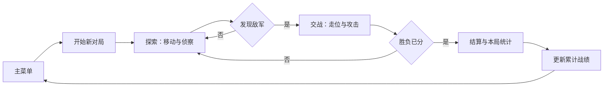
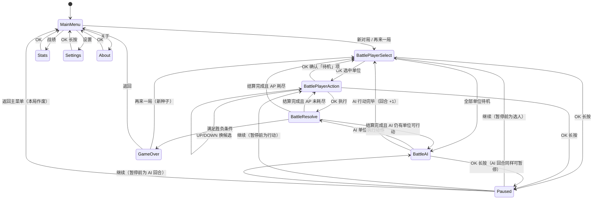

<p align="right">
  <a href="PRD_FOG_MARCH.md">English</a> · <strong>简体中文</strong>
</p>

# 迷雾三国 PRD

> 文档状态：**定稿(v1.1),已评审**(评审记录见第 21 章)
> 产品载体：FoloToy AI Passport / ESP32-C3 / 240 × 320 LCD / 三枚 ADC 按键
> 目标分支：`feature/fog-march`
> PRD 版本：v1.1
> 更新日期：2026-09-24

---

## 1. 产品概述

### 1.1 产品名称

- 中文名：迷雾三国
- 英文 UI 名:`FOG MARCH`
- 内部功能名:`Three Kingdoms Fog Tactics`

产品名已定稿,见 19.1。

### 1.2 产品定位

迷雾三国是一款运行在 FoloToy AI Passport 上的离线回合制战棋游戏。玩家与 AI 各自指挥一支小队，在 8 × 10 的战场上探索、侦察、交战。

产品的核心不是数值碾压，而是**信息博弈**：双方都只能看到自己视野内的东西，看不见的部分要靠推断。战斗胜负取决于谁先看清局势、谁更会藏。

### 1.3 核心价值

1. **信息不对称即策略**：看不见对手，逼出侦察、预判与试探。策略深度不来自复杂数值，而来自信息差。
2. **短局可中断**：一局 5 分钟左右，随时拿起放下，中途放弃无沉没成本。
3. **AI 同等受限**：AI 与玩家使用同一套视野规则，不读取视野外信息。对手是「同样摸黑的敌将」，不是全知裁判。
4. **离线可靠**：不依赖手机、账号或网络，战绩保存在设备本地。
5. **三国题材**：兵种克制、武将、要地争夺，题材与机制天然契合。

### 1.4 与既有上游应用的区别

上游 `demo/` 分支已包含俄罗斯方块（实时动作）、石头剪刀布（猜拳）、秒表，以及 `demo/funbox-11-in-1` 中的 11 个随机决策小工具（答案之书、求签、骰子、各类推荐）。**回合制策略战棋与战争迷雾在本仓库尚无实现**，本应用补齐的是「需要思考但不需要毫秒级反应」这一档，且必须按仓库规则重新设计 UI，不沿用任何现有 demo 页面。

---

## 2. 背景与设计输入

### 2.1 硬件事实

硬件能力的单一事实来源是 `components/bsp/include/bsp_pins.h`。与本应用相关的关键约束：

| 项目 | 事实 | 对设计的影响 |
| --- | --- | --- |
| 芯片 | ESP32-C3，**无 PSRAM** | 全部内存为内部 SRAM；空闲堆与最大连续块**以实机实测为准**（v0.1 的「约 400 KB」未经仓库文档证实，已删除），不能缓存大图或长音频 |
| Flash | 8 MB，app 分区 7.9 MB（`0x7f0000`，见 `partitions.csv`） | 素材与字体预算宽裕，瓶颈在 RAM 不在 Flash |
| 屏幕 | ST7789P3 240 × 320，RGB565，SPI2 @ 40 MHz | 局部刷新是实时性的关键；本游戏为回合制，压力远低于俄罗斯方块 |
| 按键 | `UP` / `DOWN` / `OK` 三键共用 GPIO0 ADC 分压 | **无法直接表达四方向**，输入方案是最大设计难点，见第 9 章 |
| 按键事件 | `PRESS` / `CLICK` / `DOUBLE` / `LONG` 四种 | BSP 能力事实；本应用实际只用其中 3 种（不注册双击，见 9.4），单击零延迟是手感底线 |
| 音频 | ES8311，I2S0 全双工，裸 PCM | 无 MP3 解码；音效用 RTTTL 文本格式，几乎不占 Flash |
| 电池 | CW2017 可读 SOC | 属**可缺省能力**，读取失败不得阻塞游戏 |
| 休眠 | 浅睡眠 / 深睡眠，仅 RTC 定时器唤醒 | 不可基于日期做连续签到类统计 |

### 2.2 可参考的上游实现

设计时提取以下分支的模式，**不整体合并**：

| 分支 | 提取什么 |
| --- | --- |
| `demo/funbox-11-in-1` | **模型分层范式**：纯 C 状态机 + 语义动作抽象，零 LVGL 依赖 |
| `demo/tetris-game` | 局部刷新（`lv_obj_invalidate_area`）、帧驱动结构、麦克风交互与扬声器干扰处理 |
| `demo/cat-themed-pomodoro-timer` | PRD 文档范式、NVS blob 带版本号 + CRC、断电恢复策略、资源生命周期 |
| `demo/claude-buddy-port` | 任务通信与状态归约（本应用为回合制，暂不需要） |

`funbox_model.c` 的关键设计值得直接沿用：

```c
bool funbox_model_apply(funbox_model_t *model, funbox_action_t action);
```

单一入口、纯 C、无 LVGL、返回「状态是否有变化」。业务层完全不接触 `BSP_BTN_*`。这个解耦是本应用可测试性的基础。

### 2.3 输入设计的核心约束

三枚按键中，`UP` / `DOWN` 只能表达两个方向，而战棋需要四方向移动。这是本应用最重要的设计约束，也是第 9 章的出发点。

**已排除的方案**：

| 方案 | 否决原因 |
| --- | --- |
| 方向选择菜单（按 `OK` 弹出 ↑↓←→） | 每次移动需 3 次按键，一局上百次移动，操作过重 |
| `OK` 单击切换水平/垂直轴 | 模态切换易迷失，误操作率高 |
| 顺序扫描全部 80 格 | 找目标格最坏情况需按数十次 |

**采用的方案**：候选格循环选择，见 9.2。

---

## 3. 关键假设与风险

**本章是全文的重点。以下假设若不成立，后续开发将失去意义，必须最先验证。**

### 3.1 最高优先级假设

> **假设 H1：在 8 × 10 格、双方视野受限的条件下，「摸黑交战」是紧张而非枯燥的。**

这是整个产品成立的前提。如果玩家在迷雾中大部分时间只是无意义地移动、找不到敌人、或觉得「全凭运气」，那么战斗系统、AI 记忆层、兵种克制全部白做。

**验证方式**：P0 版本（战场 + 迷雾 + 视野 + AI 纯搜索，无兵种无克制）完成并烧录实机试玩。**这是第一个必须真机验证的里程碑，不通过则回到设计阶段。**

### 3.2 次级假设

> **假设 H2：三键的「候选格循环」输入方案，在一局 5 分钟的对局中操作负担可接受。**

暴露出问题的形式是「玩家嫌按键太多而放弃精细操作」。验证同样依赖 P0 实机试玩。若负担过重，退路是减少单位数量（3 → 2）或增大格子（8 × 10 → 6 × 8）。

> **假设 H3：AI 在同等视野受限下仍能表现出「像个对手」，而不是随机游走。**

验证依赖 13.4 的记忆层。若 AI 表现呆滞，退路是提高其搜索权重（见 13.5 难度档位），而非放弃视野限制。

### 3.3 已识别的风险

| 风险 | 等级 | 缓解措施 |
| --- | --- | --- |
| 迷雾导致节奏拖沓，5 分钟一局撑不住 | 高 | 地图小（80 格）、初始位置接近、要地居中形成天然交汇点 |
| AI 的视野限制被玩家识破为「作弊」 | 高 | 架构层强制（13.3）+ 自动化测试（17.5） |
| 中文字形缺失导致 UI 出现空白方框 | 中 | 第 10.4 节字形清单前置核对 + 真机验收；内置思源黑体子集本身**不保证全量覆盖**，须逐字核对 |
| 候选格循环在候选多时操作繁琐 | 中 | AP 限制使候选通常少于 20 个；长按连击列为 P2，需先扩 BSP 的 HOLD 事件（9.4） |
| 26 px 格内的 3 px 兵力条在实屏上不可辨识，玩家无法判断「能否击破」 | 中 | 10.6 的真机实测待办 + 两级降级（加厚至 4 px / 改为仅提示栏显示数字） |
| 战斗数值未经过真人调参，平衡性差 | 中 | 数值集中在单一头文件，便于快速迭代 |
| **弓兵风筝流**：无反击 + 射程 2 + 机动对等，开阔地近战永远追不上弓兵 | 中 | 制衡三件套：开火暴露（8.5）、要地占领胜利（8.6）、地形与边界围堵；试玩重点验证 |
| 城池三重收益（+1 视野 + 受击减免 + 胜利条件）叠加过强 | 中 | 19.2 列候选削弱方向，试玩后调参 |

---

## 4. 目标与非目标

### 4.1 MVP 产品目标

- 用户进入应用后 **10 秒内**能理解「移动光标 → 执行动作」的基本操作。
- 一局对局时长落在 **3–8 分钟**区间。
- 玩家能明确感知「我看见了什么」与「我猜他在哪」，即迷雾是**信息**而非**噪音**。
- AI 在不读取视野外信息的前提下，表现出可观察的搜索与交战行为。
- 反复进入 / 退出战场 50 次后，无资源泄漏、无崩溃、无看门狗。

### 4.2 成功指标

设备端不采集云端行为数据，MVP 通过实机可观测指标验收：

- 首次进入战场到执行第一次动作的按键次数 ≤ 3。
- AI 决策与真实敌方位置的独立性测试全部通过（见 17.5）。
- 完成 20 局连续对局后，最小空闲堆无持续下降趋势。
- 迷雾渲染正确率：视野内 / 记忆 / 未探索三种状态在实机上无混淆。
- 一局对局的回合数落在 10–30 回合区间（低于 10 说明节奏过快，高于 30 说明拖沓）。

### 4.3 MVP 非目标

- 联网、蓝牙对战、热座双人模式；
- 局内进度存档（理由见 12.3）；
- 大地图、多城池、内政、外交、势力扩张；
- 武将养成、装备、技能树、卡牌构筑；
- 剧情、对话、事件系统；
- 触摸、震动、加速度计相关交互（硬件不存在）；
- 基于日期的连续签到或日历统计（无可靠 RTC）；
- 应用内 OTA 升级。

**关于「三国志式的大地图经营」的说明**：完整的三国志需要同时呈现地图、武将、资源、外交四类信息。本设备满屏纯文字上限约 300 字（240 ÷ 16 × 320 ÷ 16），一张武将属性表即占用半屏，三键切多层菜单的输入效率也无法支撑。**本产品因此收敛为单场战斗战术层，放弃经营层。**

---

## 5. 目标用户与使用场景

### 5.1 目标用户

- 喜欢战棋 / 策略游戏，愿意为「想一步」投入注意力的玩家；
- 希望利用碎片时间（通勤、排队、睡前）进行一局有思考含量的对局的用户；
- 对三国题材有兴趣或至少不排斥的用户；
- 不希望游戏依赖手机、账号或联网的用户。

### 5.2 核心场景

1. 用户在碎片时间打开设备，从主菜单进入新对局，指挥小队在迷雾中搜索敌军。
2. 用户发现敌人后，利用地形和兵种克制取得局部优势。
3. 用户一局打到一半需要收起设备，直接长按退出，接受本局作废（单局成本低）。
4. 对局结束后查看战绩页，确认本局结果与累计胜场。
5. 用户连续输给 AI 数次后，希望降低难度（难度档位见 18 章 P2）。

---

## 6. 产品闭环



闭环中最重要的产品规则是：**击败敌人是胜利的唯一来源，而发现敌人是击败敌人的唯一前提。** 这使「侦察」从可选操作变成核心玩法，也是迷雾机制存在的意义。

---

## 7. 信息架构

MVP 保持浅层导航，避免在三按键设备上建立过深菜单。

```text
应用启动
└── 主菜单
    ├── 新对局 ────────> 战场
    │                     ├── 我方回合
    │                     ├── AI 回合
    │                     ├── 战斗结算（短暂覆盖层）
    │                     └── 对局结束 ──> 战绩页
    │                                        └── 返回主菜单
    ├── 战绩
    ├── 设置（静音 / 难度，与 12.1 持久化字段一一对应）
    └── 关于（产品名 / 版本号 / MIT 许可 / 一行简介）
```

战场内部的长按 `OK` 打开暂停菜单（继续 / 重新开始 / 返回主菜单），不新增导航层级。

对局结束页展示本局结果（胜 / 负 / 平）、回合数与击破数，固定两个选项：`再来一局`（同难度直接重开）与 `返回主菜单`。

---

## 8. 核心功能需求

### 8.1 战场与地形

战场固定为 **8 列 × 10 行 = 80 格**，纵向排布以匹配 240 × 320 的竖屏比例。

| 地形 | 通行 | 视线 | 效果 |
| --- | --- | --- | --- |
| 平地 | 可 | 通 | 无 |
| 山地 | 可（1 AP） | **阻挡** | 站山单位受击伤害 × 0.67 |
| 林地 | 可（2 AP） | **阻挡** | 在其中的单位对切比雪夫距离 ≥ 3 的敌方不可见；距离 ≤ 2（含边界距离 2，即弓兵射程内）照常可见 |
| 河流 | **不可** | 不阻挡 | 形成天然分割线，引导行军路线 |
| 城池（要地） | 可（1 AP） | 通 | 提供 +1 视野；站城单位受击伤害 × 0.67 |

规则：

- 地图在每局开始时随机生成，且必须满足**连通性**（任意可通行格互相可达）；
- 生成使用可复现的种子（`uint32_t`），相同种子必须产出相同地图，便于测试与复现问题；
- **随机性唯一来源**：全部随机行为（地图生成与开局先手）由地图种子驱动的**自带确定性 PRNG**（如 splitmix32 / xoshiro128）产生；**禁止**调用 `rand()`、`esp_random()` 或任何平台相关随机源，否则「相同种子可复现」无法跨平台成立，17.5 的种子复现测试也无法在主机侧运行；
- 河流必须成条带分布，不得生成无法翻越的环形封闭区；
- 地图中央区域固定放置 1 座城池作为要地；
- 双方初始位置固定在地图两侧：我方为第 0 列的 (0, 3)、(0, 4)、(0, 5)，敌方镜像为第 7 列的 (7, 3)、(7, 4)、(7, 5)（x 为列，y 为行）。开局距离可控（见 3.3 节奏风险），连通性校验必须覆盖全部出生格；
- **一格一单位**：任何时刻每格至多 1 个单位，不分敌我。移动路径可穿过友方单位、不可穿过敌方单位，落点必须是无单位格；
- 内置一张固定地图（编译期常量）作为随机生成连续失败时的兜底（见第 14 章）。

### 8.2 单位与兵种

每方 3 个单位。玩家控制「我军」，AI 控制「敌军」。

| 兵种 | 兵力 | 视野半径 | 攻击距离 | 克制 |
| --- | ---: | ---: | ---: | --- |
| 枪兵 | 10 | 2 | 1 | 克骑兵 |
| 骑兵 | 8 | 2 | 1 | 克弓兵 |
| 弓兵 | 6 | 3 | 2 | 克枪兵 |
| 主将 | 12 | 3 | 1 | 不参与克制（双向中性，见规则） |

克制循环：**枪 → 骑 → 弓 → 枪**。

**初始阵容（每方固定 3 单位）：主将 + 枪兵 + 弓兵。** 骑兵不入初始阵容——在 3 AP 上限下其「机动」定位与普通单位高度重叠，留作后续阵容扩展（4 v 4 或开局选兵，见 19.1 决策 11）。双方阵容镜像对称，保证公平；枪（近战肉盾）、弓（远程侦察）、主将（观察者与旗帜）恰好覆盖三种战术角色。

**视野与攻击距离的设计依据（必须在调参时保持）**：三个战斗兵种的基础视野半径恒等于其攻击距离 + 1（枪 2/1、骑 2/1、弓 3/2）。结合 8.4 的行动点限制——攻击 2 AP、移动 1 AP、每回合 3 AP，故单回合最多「移动 1 格并攻击」——该关系保证了：

> **单位首次看见敌人的距离，恰好就是它走一步便能攻击的距离。**

遭遇战因此不需要额外的「接近回合」：发现即能动手，节奏直接且可预期，迷雾带来的紧张感也不会被拖沓的走位稀释。**调整任一兵种的视野半径或攻击距离时，必须同步复核此关系**，否则会破坏遭遇节奏。

**主将是刻意的例外**：视野 3、攻击距离 1，比上述规律多 1 格视野。它在首次发现敌人时**无法当回合攻击**（需接近 2 格，将耗尽 3 AP）。这是有意设计——主将的定位是**观察者与旗帜**，而非输出单位：它的价值来自更远的预警，以及为相邻友军提供的伤害 +1（见 8.5）。实现与调参时不应把它「修正」为符合规律。

该规律仅约束**基础视野**。8.3 的「站城单位视野 +1」是刻意的临时修正，不受此约束。

规则：

- 每方恰好 1 名主将，队伍全灭或主将阵亡均可作为败因（见 8.6）；
- **「主将不参与克制」为双向语义**：主将作为攻击方时恒按中性 × 1.0 结算；任何单位攻击主将时也恒按中性结算，无视克制系数。主将的价值在视野、加成与生存（12 兵力 = 中性下 4 刀），不在克制博弈；
- 单位兵力归零即撤离战场，不可复活；
- **兵力数值为初始设定值，必须在实机试玩后统一调参**，集中定义于单一头文件以便快速迭代。

### 8.3 战争迷雾与视野

迷雾分三种状态，**必须向玩家明确区分**：

| 状态 | 含义 | 渲染 |
| --- | --- | --- |
| 视野内 | 当前有己方单位看到 | 地形与单位全彩显示 |
| 已探索 | 曾经看到过，当前无视野 | 地形以低饱和度暗色显示；**敌方单位不显示** |
| 未探索 | 从未看到过 | 纯黑；不显示任何信息 |

视野规则：

- 基础视野为切比雪夫距离 ≤ 半径（即半径 2 对应 5 × 5 方形区域）；
- 站城单位视野半径 +1；
- **山与林阻挡视线**，使用射线判定（`Bresenham` 或等价算法）；被阻挡的格子不可见；
- **射线端点规则**：阻挡判定只检查观察者格与目标格之间的**中间格**；**起点格与目标格自身的地形不参与阻挡**。否则山地 / 林地格永远无法被看见并标记为「已探索」，且 8.1 林地「距离 ≤ 2 照常可见」的规则无法自洽（林地中的单位所在格是目标格，若目标格自身阻挡则永远不可见）。同理，观察者自身所站的山地 / 林地格不阻挡自己的视野；
- 林地对位于其中的单位提供隐蔽（见 8.1）；
- 视野在单位移动后立即重算。

**已探索地形永久记忆，敌方单位信息实时失效。** 这是迷雾紧张感的来源：玩家记得「这里三天前有个敌将」，但不确定他还在不在。

### 8.4 回合与行动点

- 对局为**严格回合制**：我方全部单位行动完毕 → AI 全部单位行动完毕 → 下一个回合；
- 每个单位每回合获得 **3 点行动力（AP）**；
- 移动 1 格消耗 1 AP（林地 2 AP）。候选列表展示的是 **AP 预算内的全部可达格**（BFS 最短路，林地按 2 AP 计入路径消耗；中途格也作为独立候选——玩家可以只走 1 格停下再决定下一步）。路径可穿过友方单位、不可穿过敌方单位，落点必须为无单位格（占用规则见 8.1）；
- 攻击消耗 2 AP，且**每单位每回合最多攻击 1 次**；
- AP 耗尽后该单位自动待机；
- 玩家可在 AP 未耗尽时主动让单位待机：将候选列表循环至固定末位的「待机」项并确认（见 9.2、9.4）；
- 全部我方单位待机后，回合自动移交给 AI；
- **先手由地图种子决定**（保证可复现）：每局随机由我方或敌方先行动。在无反击规则下先手方占优，先手随机化是对这一结构性优势的制度性稀释，也避免 AI 永远后手吃亏。

由此，一个单位的典型回合是「走 1 格后攻击」，或「走 3 格占位」，形成**进攻与机动之间的取舍**。

### 8.5 战斗结算

攻击方对目标造成伤害：

```text
伤害 = 基础攻击力 × 克制系数 × 目标地形减免
```

| 因子 | 取值 |
| --- | --- |
| 基础攻击力 | 3 |
| 克制（克制方） | × 1.5 |
| 克制（被克方） | × 0.67 |
| 中性 | × 1.0 |
| 山地 / 城池减免 | × 0.67 |
| 主将相邻友军加成 | 伤害 +1 |

**结算顺序与取整**（必须严格按此顺序，否则同一局面会产生不同结果）：

```text
第 1 步  乘法部分 = floor(基础攻击力 × 克制系数 × 目标地形减免)
第 2 步  乘法部分 = max(乘法部分, 1)                  // 最低伤害保底
第 3 步  最终伤害 = 乘法部分 + 主将相邻友军加成
```

- 乘法部分**向下取整**，加法项在**乘法之后**结算；
- 最低伤害 1 保证任何攻击都至少造成 1 点削减，杜绝「双方都打不动」的对峙僵局；
- 主将加成是**固定的 +1，不参与乘法放大**。若写在乘法之前，克制时会变成 `(3 + 1) × 1.5 = 6`，违背它作为稳定战术增益的定位。

由此得到全部伤害档位。这张表是玩家心算与 UI 提示栏的共同依据：

| 情形 | 计算 | 伤害 |
| --- | --- | --- |
| 中性、无地形减免 | `3 × 1.0` | 3 |
| 中性 + 地形减免 | `3 × 1.0 × 0.67` | 2 |
| 克制方 | `3 × 1.5` | 4 |
| 克制方 + 地形减免 | `3 × 1.5 × 0.67` | 3 |
| 被克方 | `3 × 0.67` | 2 |
| 被克方 + 地形减免 | `3 × 0.67 × 0.67` | 1 |
| 克制方 + 主将相邻加成 | `4 + 1` | 5 |

其余规则：

- 战斗为**确定性结算**，无暴击、无闪避、无随机数，保证可复现与可测试；
- 结算结果以短暂覆盖层呈现（伤害数字 + 兵力条变化），持续约 800 ms；
- 弓兵攻击距离为 2，可在不相邻的格子上发起攻击；其余兵种的攻击距离为 1，必须与目标相邻才能攻击；
- **攻击需要视线**：目标必须在攻击者视野内，且攻击路径不被山与林阻挡（与 8.3 视野同一套射线判定，含 8.3 的端点规则）。弓兵无法隔山射击；
- **主将加成的「相邻」**为切比雪夫距离 1（含斜向共 8 格，与视野度量一致）；主将自身攻击不享受自己的加成（加成只作用于相邻友军）；
- **开火暴露**：单位执行攻击的瞬间，其所在格对敌方全体公开（「放箭有火光」）——无视视野与遮挡，写入敌方的最后已知位置记忆并按 10.3 的虚影规则显示，直至敌方获得更新的观测。这是弓兵风筝流的核心制衡：每开一枪，位置就暴露一次；
- 攻击相邻目标时，若目标存活且未被击败，**目标不自动反击**（避免额外状态复杂度，列为 P1 评估项）。

### 8.6 胜负条件

**胜利**（满足任一）：

1. 击破敌方全部单位；
2. 击破敌方主将；
3. 我方单位占据要地并**连续保持 3 个完整回合**。判定规则：1 个「完整回合」= 我方行动阶段 + 敌方行动阶段全部结束；每对完整回合结束时检查——要地上存在我方单位且无敌方单位则计数 +1，否则清零。「驱逐」= 敌方单位站上要地，或我方占领单位被击破 / 主动离开。一格一单位规则（8.1）保证双方不可能同时占据要地。

**失败**：

1. 我方全部单位被击破；
2. 我方主将被击破；
3. 敌方占据要地连续 3 个完整回合。

**平局**：达到回合上限（默认 40 回合）时双方均未满足胜利条件，判为平局。

多条件并存的意义：给劣势方留出翻盘路径（偷要地），避免「谁兵多谁赢」的单调终局。

### 8.7 AI 对手

AI 使用与玩家**完全相同**的视野规则，且代码层面不得读取视野外信息。三层结构见第 13 章。

### 8.8 局外统计

对局结束后更新并在战绩页展示：

| 字段 | 说明 |
| --- | --- |
| 总局数 | 累计完成的完整对局数 |
| 胜 / 负 / 平 | 分项计数 |
| 最长连胜 | 历史最高连续胜场 |
| 击破数 | 累计击破的敌方单位数 |
| 最快胜局 | 取胜所用的最少回合数 |

**不含任何基于日期的统计**（无可靠 RTC，见 2.1）。

### 8.9 音效与静音

- 移动、攻击、受击、单位阵亡、胜负结算各一段短音效；
- 音效使用 **RTTTL 文本格式**，不引入音频文件，Flash 占用可忽略。仓库当前**无现成 RTTTL 依赖**：解析器与方波 PCM 合成为自研纯 C 实现（无 ESP-IDF / LVGL 依赖），纳入主机测试；
- 在设置中切换静音，状态持久化；
- ES8311 初始化失败时**仅禁用音效**，不得禁用游戏逻辑与渲染；
- 音频播放必须在独立任务中执行，不得阻塞按键回调或 LVGL 任务。

---

## 9. 三按键交互定义

### 9.1 按键手势分配

| 手势 | 用途 |
| --- | --- |
| `UP` / `DOWN` 单击 | 在候选列表或菜单项间循环 |
| `OK` 单击 | 执行当前高亮项 |
| `OK` 长按 | 返回上一层 / 打开暂停菜单 |
| `UP` / `DOWN` 长按 | 保留；P2 候选快速连击，需先扩展 BSP（见 9.4） |

三个键**均不注册双击事件**，理由见 9.4。

### 9.2 候选格循环选择（核心方案）

这是本应用解决「三键无法表达四方向」的关键机制。

当一名我方单位被选中时，该单位当前**所有合法动作的目标格**构成一个有序候选列表（可达格的构成规则见 8.4 移动条目）：

1. **排序规则**：先按动作类型（可移动格 → 可攻击目标），同类内按方位环固定顺序（上、右、下、左），同方位内按到单位的距离升序，同距离再按 y、x；
2. **固定末位**：排序完成后在列表末尾追加一个「待机」伪项。它不对应任何格子、不参与上述排序，位置恒定为最后一项；
3. `UP` 选中前一个候选，`DOWN` 选中后一个候选，**首尾循环**（自「待机」继续按 `DOWN` 会回到第一个可移动格）；
4. 当前候选格以高亮边框显示，**其余候选格以淡化 1px 边框显示（移动蓝、攻击橙），使活动范围一眼可读**；同时底部提示栏显示该动作的类型与消耗；**攻击候选还须给出预期伤害与目标剩余兵力**（完整的提示栏规则见 10.6）。选中「待机」时提示栏显示 `待机 结束该单位行动`；
5. `OK` 单击执行高亮候选；若高亮项是「待机」，该单位结束行动，控制权回到选人状态。这是玩家在 AP 未耗尽时主动待机的**唯一途径**（为何不用双击见 9.4）；
6. 若列表仅剩「待机」一项或候选为空（AP 耗尽或被包围），该单位自动进入待机；
7. **候选列表面板**：行动阶段在地图区上方叠加一个半透明列表面板，逐行列出全部候选（`移动 (x,y) nAP` / `攻击 敌<兵种> 伤n` / `待机`），当前候选以 `>` 前缀和类型色底高亮，UP/DOWN 循环时高亮与滚动窗口同步；`OK` 执行当前候选后面板随状态刷新。列表超过 14 行时以当前项为中心滑动窗口。面板为提示栏之外的第二读取通道，解决「移动/攻击/待机切换不显眼」的试玩反馈。

排序规则必须稳定：**同一状态下反复按 `UP`/`DOWN` 必须产生完全可预测的顺序**，不得使用任何影响顺序的随机因素。

H2 验证结论（2026-09-24 实机试玩）：原「距离优先」顺序在连续按 `DOWN` 时方向感破碎——高亮在四个方位间来回跳，体感如同随机走位。已按本节预案调整为方位环优先：连续按 `DOWN` 沿一个方位由近及远推进，跨方位才进入下一环。配套新增候选范围淡色边框显示（见第 4 条）。

### 9.3 完整交互表

| 页面 / 状态 | `UP` | `DOWN` | `OK` 单击 | `OK` 长按 |
| --- | --- | --- | --- | --- |
| 主菜单 | 上一项 | 下一项 | 进入 | 无操作 |
| 战场 · 我方回合 · 选人 | 上个我方单位 | 下个我方单位 | 选中并进入行动 | 暂停菜单 |
| 战场 · 我方回合 · 行动 | 上个候选格 | 下个候选格 | 执行高亮项（含「待机」） | 暂停菜单 |
| 战场 · AI 回合 | 加速动画 | 加速动画 | 无操作 | 暂停菜单 |
| 战斗结算覆盖层 | 无操作 | 无操作 | 跳过等待 | 无操作 |
| 暂停菜单 | 上一项 | 下一项 | 选择 | 关闭菜单 |
| 对局结束 | 上一项 | 下一项 | 选择 | 返回主菜单 |
| 战绩页 | 无操作 | 无操作 | 返回 | 返回主菜单 |
| 设置 | 上一项 | 下一项 | 切换该项 | 返回主菜单 |
| 关于 | 无操作 | 无操作 | 返回 | 返回主菜单 |

无操作的按键不得发出错误音，也不得改变状态。

**按键回调不得阻塞**（`bsp_button.h` 明确要求回调运行于共享 `esp_timer` 任务）。所有游戏逻辑在主循环或 LVGL 定时器中处理，回调只负责入队。

### 9.4 为何三个键都不使用双击

**结论：`UP` / `DOWN` / `OK` 均不注册双击事件。**

这不是偏好，而是一条因果链：

1. 要区分单击与双击，按键驱动**必须等双击判定窗口超时**，才能确定一次按下属于单击、而非某次双击的第一次；
2. 因此**任何注册了双击的键，其单击都带有该窗口的固有延迟**；
3. 本应用三个键的单击**全部承载高频操作**——`UP` / `DOWN` 驱动候选格循环（一局按压上百次），`OK` 执行动作。把延迟加在其中任何一个上都会直接损伤手感；
4. 所以**不能靠「把双击换到另一个键」来规避**，只能整体放弃双击。

长按不受此影响：长按是**独立计时**的判定路径，松手即按单击结算，不阻塞单击响应。因此 `OK` 长按承载暂停菜单是安全的。

**替代方案**：双击原本承担的「主动待机 / 切换控制权」，已由候选列表固定末位的「待机」项承担（9.2 第 2、5 条），零新增按键、零延迟。

**需要的 BSP 改动（两处）**：

1. **移除双击注册（本项目必需）**：`components/bsp/src/bsp_button.c` 的 `register_callbacks()` 目前**已注册 `BUTTON_DOUBLE_CLICK`**（v1.0 评审已对照源码核实，`bsp_button.c:121`）——也就是说，按 BSP 现状直接实现，单击天然带有双击等待窗口。需在该函数中移除双击注册，使三个键只保留 `PRESS_DOWN` / `SINGLE_CLICK` / `LONG_PRESS_START`。`bsp_button.h` 中 `bsp_btn_ev_t` 枚举的 `BSP_BTN_DOUBLE` 条目**保留不动**，供其他应用使用，本应用不再接收该事件。
2. **增注册 `BUTTON_LONG_PRESS_HOLD`（P2 需要）**：`LONG_PRESS_START` 仅在长按开始时上报一次，**不提供周期性重复**，无法支撑「候选快速连击」。新增事件类型对既有调用方向后兼容，不影响 `main` 现有 demo。

> **实现时须验证**：「不注册双击回调时单击无延迟」是 `espressif/button` 4.2.0 常见实现的推断（依赖组件源码，仓库内未 vendored，静态评审无法确认）。若不注册双击回调时单击确实无延迟，本节取舍成立；若组件在仅注册单击时仍引入等待窗口，退路是改用 `PRESS_DOWN` 事件，并配合即时视觉反馈（按下瞬间即出高亮与音效）掩盖延迟。

---

## 10. UI 与视觉规范

### 10.1 屏幕规格

- 分辨率 240 × 320，竖屏；
- 色彩 RGB565；
- 风格：像素风、高对比、深色底；
- UI 文案：中文（字体方案见 10.4）；
- 最小正文：对应 14 px 等效字号。

### 10.2 战场页布局

```text
┌────────────────────────┐ 0
│ 回合 07  我军 3 AI 3 75%│ 状态栏 28 px（右侧为电量）
├────────────────────────┤ 28
│                        │
│                        │
│      8 × 10 战场        │ 战场 260 px
│      每格 26 px         │ (10 行 × 26)
│                        │
│                        │
├────────────────────────┤ 288
│ 移动 1AP     枪兵 8/10 │ 提示栏 32 px
└────────────────────────┘ 320
```

宽度核算：8 × 26 = 208，左右各留 16 px 边距，共 240 ✓
高度核算：28 + 260 + 32 = 320 ✓

图中的提示栏内容仅为示意：提示栏随当前高亮对象变化，格内兵力条与数值显示方案见 10.6。

状态栏在敌方回合期间以 `AI 行动中` 替换兵力计数，为玩家提供明确的阶段指示。UI 文案一律不使用 `◆`、`·` 等非常用符号（CJK 子集覆盖存疑，见 10.4），单位归属以颜色区分。

**电量显示（仓库默认不变量）**：依据 `docs/development/ai-guide.md` 运行时不变量，应用 UI 默认在**右上角**显示电量（`bsp_battery_soc()` 读取）。本应用落在状态栏右端：显示 SOC 百分比；读取失败（返回 -1）时**该位留空、不绘制任何数字**，不阻塞游戏（与第 14 章降级表一致）。

### 10.3 迷雾渲染

- 三种迷雾状态必须**在灰度与亮度上明显区分**，不依赖细边框差异；
- 未探索区域使用纯黑，且不绘制任何地形细节；
- 已探索区域使用低饱和度的地形色，与视野内形成清晰对比；
- 敌方单位仅在当前视野内绘制；**例外（开火暴露，见 8.5）**：刚执行过攻击、敌方尚无更新观测的单位，以暗色虚影绘制在其最后已知位置；
- AI 单位在玩家视野**外**的移动不产生任何画面变化——不显示轨迹、不显示位置提示，否则迷雾即告失效。AI 单位进入视野的瞬间出现，离开的瞬间消失；
- 渲染采用**局部刷新**：单位移动时只重画受影响的两格及视野变化的格子，不整屏重绘。参考 `demo/tetris-game` 的 `lv_obj_invalidate_area()` 用法。

### 10.4 中文字体方案

**这是本应用的第 3 大技术风险（见 3.3）。** 默认配置中的 Montserrat 14 / 20 **不含任何中文字形**；UTF-8 编码正确、编译成功都**不代表**能显示中文。且 LVGL 9.5.0 内置的思源黑体简体中文字集**本身也是子集，不保证覆盖全部常用字**（依据 `docs/development/engineering/lvgl-chinese-fonts.md`），逐字核对不可省略。

**方案 A（首选）**：启用 LVGL 内置的思源黑体简体中文字集。

```text
CONFIG_LV_TXT_ENC_UTF8=y
CONFIG_LV_USE_FONT_PLACEHOLDER=y
CONFIG_LV_FONT_SOURCE_HAN_SANS_SC_16_CJK=y
```

以上 Kconfig 名已对照本仓库锁定的 LVGL 9.5.0 与字体工程文档核实。设置须写入本应用跟踪的 `sdkconfig.defaults`，并在构建后核对生成的 `sdkconfig`（固件门禁使用独立生成的配置）。

**必须在开发早期（而非发布前）前置核对字形覆盖。** 以下为本应用 UI 需要的中文字符清单，须逐字验证（用 `lv_font_get_glyph_dsc()` 按码点检查，不得目测）：

```text
迷雾三国 枪兵骑弓主将 兵力 行动移动攻击待机 结束回合 视野侦察
山地林地河流城池要地 胜利失败平局 我方敌方 统计设置 新游戏
继续退出暂停重新开始 战斗结算 击破 命中伤害 恢复跳过 确认取消
目标距离地形隐蔽防御 加成剩余 总览战绩连胜最高 难度简单普通困难
关于存档已重置不可用 再来一局行动中 电量
```

前四行为核心清单，末行为后续章节新增文案的用字（7 章对局结束页与关于页、10.2 状态栏 AI 指示与电量、12.4 存档提示）。`◆`、`·` 等符号已从全部 UI 示例中移除，UI 不依赖任何 CJK 子集覆盖存疑的符号。

**缺字回退策略**（按优先级）：

1. 若缺字数量少（≤ 5 个），以同义字替换文案（如「击破」→「消灭」）；
2. 若内置子集覆盖不足，生成仅含上表字符的 LVGL 子集字体作为独立源文件编译进应用（方案 B）；
3. 若字体工作量超出预期，退回英文 UI（英文名已在 1.1 定义）。

**方案 A 与 B 都必须经过真机验收**：核对字形覆盖、控件实际字体、实屏渲染三步（依据 `docs/development/engineering/lvgl-chinese-fonts.zh_CN.md`）。

### 10.5 色彩建议

| 用途 | 建议色 | 说明 |
| --- | --- | --- |
| 我军单位 | 蓝系 | 与地形色区分 |
| 敌军单位 | 红系 | 仅在视野内出现 |
| 低兵力警示（剩余 ≤ 3） | 警示橙 | 覆盖单位兵力条填充色，见 10.6 |
| 当前光标 | 高亮描边 | 与单位底色形成强对比 |
| 可移动候选格 | 冷色半透明描边 | |
| 可攻击候选格 | 暖色半透明描边 | |
| 山地 | 棕灰 | |
| 林地 | 墨绿 | |
| 河流 | 深蓝 | |
| 城池 | 赭黄 | |

色彩定义集中管理，不得在渲染代码中散落硬编码色值。上表已随 10.7 的素材生成器落地：地形与单位色板实现于 `tools/gen_fog_march_assets.py`，修改配色须改生成器色板并重生成素材，不得在渲染代码中另行定义。

### 10.6 兵力显示

**本节填补一处此前的缺口**：10.2 只规定了提示栏显示选中单位的兵力，但攻击决策**必须能看出敌方还剩多少兵**，否则 8.4 的 AP 取舍与 8.5 的伤害计算都无从判断。

约束来源：26 px 的格子里放不下任何数字（中文字集字号 16 px，两个字就占去半格宽）。因此兵力采用**分层显示**——格内给绝对量化的图形，精确数值交给提示栏。

**格内兵力条**

水平居中、贴格子底边内缩 2 px，尺寸固定为 **22 × 3 px**：

| 部位 | 长度计算 |
| --- | --- |
| 槽（深灰底） | `floor(满员兵力 / 12 × 22)` px |
| 填充 | `floor(剩余兵力 / 12 × 22)` px |

**按绝对兵力刻度绘制，而非按剩余比例绘制。** 这是本设计的关键决策，理由：

- 比例条下，「6/6 的弓兵」与「6/12 的主将」外观完全相同（都是半格），但两者在攻击决策中的含义相反——前者是满员劲敌，后者是残兵；
- 战斗为固定伤害、通常 2–4 刀分出生死，玩家真正要判断的是「**这一刀能否击破**」，这是绝对值问题而非比例问题；
- 绝对刻度下屏幕内所有单位可横向直接比较，判别规则只有一句好记的话：**槽与填充等长 = 满员**。

边界规则：

- 剩余兵力 > 0 时填充**至少 1 px**（`1 / 12 × 22 = 1.83 → 1`），保证残兵仍可见；
- 单位阵亡后不绘制兵力条；
- 已探索区域的敌军单位本身不显示（见 10.3），其兵力条同样不绘制。

配色沿用 10.5：我军用青蓝填充、敌军用红填充。另加**低兵力警示**：剩余 ≤ 3 时填充转为警示橙——3 恰为基础攻击力，即「再挨一刀必死」。

**提示栏精确数值**

提示栏高 32 px、整宽 240 px，可容纳约 15 个 16 px 中文字符。内容随当前高亮对象变化：

| 当前高亮对象 | 提示栏内容 | 示例 |
| --- | --- | --- |
| 我方单位（选人阶段） | 兵种 + 剩余 / 满员 | `枪兵 8/10` |
| 可移动候选格 | AP 消耗 | `移动 1AP` |
| 可攻击候选格 | AP 消耗 + **预期伤害** + 目标兵种与兵力 | `攻击 2AP 伤4 敌弓兵 6/6` |

**攻击候选必须同时给出预期伤害与目标剩余兵力。** 这是玩家判断「这一刀能否击破」的唯一依据；只显示 `攻击 2AP` 时玩家需自行记忆目标血量，等于该信息不可用。`UP`/`DOWN` 循环候选格时提示栏同步刷新——候选格循环本就要求高亮完全可预测，提示栏跟随是零成本的。

预期伤害须**复用 8.5 的结算函数**，不得在渲染层另行实现，否则取整规则一旦调整，UI 显示与实战结果将不一致。

**字段截断优先级**：文案超出提示栏宽度时，按 `AP 消耗` → `预期伤害` → `目标兵力` 的顺序保留，兵种名可缩写为单字（`枪` / `骑` / `弓` / `将`）。

**真机验证待办**：3 px 条在 240 × 320 实屏上的可辨识度**无法在纸面验证，禁止臆断**，须在 P0 试玩时实测确认。若不清晰，按以下顺序降级：① 加厚至 4 px；② 改为仅在提示栏显示数字、格内不绘制条。

### 10.7 素材策略（素材先行）

**决策**：美术素材先于 P0 开发落地（2026-09-24 用户决策）。战场地形与单位采用像素 sprite，不再以纯色块表达；兵力条、候选格描边、迷雾虚影等动态元素仍为程序化绘制（sprite 无法覆盖），虚影以单位 sprite 的运行时透明度实现。

**清单与预算**：18 张 26 × 26 sprite——5 种地形 × 明/暗两变体（视野内 / 已探索迷雾态）+ 4 兵种 × 红蓝两阵营，合计 29,744 字节。数据经 CMake `EMBED_FILES` 嵌入，直接从 Flash 绘制，不占堆，远低于 7.9 MB 分区预算。

**格式**：`.rgb565`（不透明地形，小端 RGB565）与 `.rgb565a8`（单位，RGB565 平面 + A8 透明平面），对应 LVGL 9 的 `LV_COLOR_FORMAT_RGB565` / `LV_COLOR_FORMAT_RGB565A8`。管线沿用 `demo/rock-paper-scissors` 先例（`tools/gen_rps_assets.py` → `main/assets/` → EMBED_FILES → 运行时包装 `lv_image_dsc_t`）。

**事实来源与再生成**：唯一事实来源是 `tools/gen_fog_march_assets.py` 内的 ASCII 像素图与色板（本仓库原创美术，MIT 许可）。修改后重跑生成器并连同输出一并提交；`tests/test_fog_assets.py` 校验提交数据与全新再生成**字节级一致**，已接入 `tools/validate.sh --static`。预览位于 `assets/fog-march/preview/`（含 contact sheet），仅供目视评审，不是编辑源。

**放置**：固件数据 `main/assets/fog_*`；文档与预览 `assets/fog-march/`（登记于该目录 README 与 `assets/README.md`）。

**实机验收**：RGB565 实屏上的色彩还原、三种迷雾状态（含地形 dim 变体）的可辨性、红蓝阵营一望可辨，纳入 17.4 验收。

---

## 11. 状态机



**暂停必须记忆来源状态**：`继续` 回到暂停前的状态（选人 / 行动 / AI 回合），而不是固定回某个状态——否则 AI 回合会被暂停吞掉。

状态迁移必须是**纯函数**，不接受 LVGL 或 ESP-IDF 类型，以便主机测试覆盖（见 15.1）。

---

## 12. 数据与持久化

### 12.1 持久化的内容

只持久化**局外统计与设置**，使用带版本号与 CRC 的单一 NVS blob。

| 字段 | 类型 | 说明 |
| --- | --- | --- |
| schema_version | uint16 | 数据结构版本 |
| total_matches | uint32 | 累计对局数 |
| wins / losses / draws | uint32 | 分项计数 |
| longest_win_streak | uint32 | 历史最长连胜 |
| current_win_streak | uint32 | 当前连胜（用于维护最长值） |
| total_kills | uint32 | 累计击破数 |
| fastest_win_rounds | uint16 | 最快胜局回合数，0 表示尚无 |
| difficulty | uint8 | 难度档位 |
| muted | bool | 静音状态 |
| crc | uint32 | 数据完整性校验 |

### 12.2 保存时机

- 对局结束时（一次性事务更新全部战绩字段）；
- 修改难度或静音设置时；
- 不进行每回合保存。

### 12.3 为什么不保存局内进度

这是一项**明确的设计决策**，而非疏漏：

1. 一局仅 5 分钟左右，重开一局的成本低于读档的认知成本；
2. 序列化完整的战斗状态（地图、单位、AP、视野、AI 信念地图）会显著增加状态面与 bug 风险；
3. 「随时放下」的体验目标是**单局成本低**，而不是**可以挂起**。

若实机试玩后认为该决策有误，列为 P2 重新评估（见 19.1 决策 4）。

### 12.4 数据异常处理

- blob CRC 无效时**使用默认值并显示一次 `存档已重置` 提示**（CRC 失败意味着 blob 整体不可信，不做部分恢复）；版本不匹配时执行显式迁移或安全重置，不得崩溃；
- NVS 不可用时应用以**临时模式**运行，战绩不承诺跨重启保留，界面显示 `存档不可用`，游戏本身仍可正常游玩；
- 版本迁移必须显式实现或安全重置，不得崩溃。

---

## 13. AI 对手设计

本章是本应用的技术核心。**AI 的公平性是产品可信度的基础。**

### 13.1 三层结构

```text
感知层 Perception   只读取己方视野内的信息 → observation_t
        ↓
记忆层 Belief       维护敌方位置的概率地图 → belief[8][10]
        ↓
决策层 Decision     基于 observation + belief 选择动作
```

### 13.2 为什么必须分层

朴素的战棋 AI 是**全知**的：直接读取整个游戏状态求最优解。若在本游戏中使用，AI 会表现出「隔着迷雾精准奔向玩家位置」的行为。玩家一旦识破，迷雾机制就失去意义，产品核心价值崩塌。

因此 AI 必须**只通过 `observation_t` 获取信息**。

### 13.3 架构层强制（关键）

```c
typedef struct {
    uint8_t terrain_known[8][10];   /* AI 已观测到的地形，未观测为未知 */
    uint8_t visible[8][10];         /* 当前视野（己方全部单位叠加） */
    uint8_t enemy_known[8][10];     /* 当前确认存在的敌方格（视野内 + 开火暴露，见 8.5） */
    uint8_t last_seen_round[8][10]; /* 每格最后一次确认有敌的回合，0 表示从未 */
    uint8_t objective_x, objective_y; /* 要地位置（地图中央，AI 探索后可用） */
    uint8_t objective_owner;        /* 要地占领方：0 无 / 1 我方 / 2 敌方 */
    uint16_t round;                 /* 当前回合数（信念衰减的基准） */
    fog_unit_t own[3];              /* 己方单位：位置、兵力、AP */
} fog_observation_t;

fog_action_t fog_ai_decide(const fog_observation_t *obs, const fog_ai_memory_t *mem);
```

**决策函数签名只接受 `obs` 与 `mem`，不接受真实战场状态。** 这是编译期可保证的约束，而非纪律要求。P0 起 AI 即通过该接口决策，P0 的 `mem` 为空实现（无信念地图）——不例外、不 shortcuts，否则 P1 将引入架构重构。

### 13.4 记忆层（信念地图）

AI 维护 `belief[8][10]`，每格记录**期望敌方单位数量**（取值 [0, 3]，允许小数）——敌方有 3 个单位，单标量概率场无法表达多单位分布，期望数量的语义更直接：决策层用它评估「往哪个方向搜索值得」。**总和恒等于敌方存活单位数**（守恒约束），归一化以此为基准。

更新规则：

1. **观测到敌方格**（视野内发现，或目标开火暴露，见 8.5）：该格概率置为确定值，并记录 `last_seen_round`；
2. **已观测且确认无敌方格**：概率清零；
3. **视野外格子**：按回合数衰减并向相邻格**扩散**——因为敌方单位会移动。扩散模型使用固定的确定性公式，不引入随机数，保证可复现；
4. 概率归一化，保证总和守恒。

`last_seen_round` 是紧张感的来源：3 回合前看到的敌将，AI 会认为他「可能还在附近」，但置信度下降。这使 AI 的行为**像有经验的人类**——往你上次出现的方向摸。

### 13.5 决策层

效用函数在以下行为间择优：

| 行为 | 触发条件 | 权重影响因素 |
| --- | --- | --- |
| 交战 | 视野内有敌方单位 | 克制关系、目标兵力、自身兵力 |
| 搜索 | 无可见敌人 | 信念地图高概率区域的距离 |
| 占要地 | 要地无主或可夺取 | 距离、当前回合计 |
| 撤退 | 自身兵力过低且有可见强敌 | 兵力比、退路是否被阻断 |

难度档位通过**调整效用权重与信念衰减速度**实现，**不通过解除视野限制**：

| 档位 | 特征 |
| --- | --- |
| 简单 | 搜索倾向低，交战判定保守，信念衰减快（更容易「忘记」） |
| 普通 | 默认权重 |
| 困难 | 搜索倾向高，会主动占要地，信念衰减慢（记忆更长久） |

### 13.6 性能约束

- 决策必须在 **50 ms 内**完成，否则 AI 回合会有可感知的卡顿；
- 候选动作空间为「3 单位 × 约 20 候选格」，规模极小，无需复杂剪枝；
- 信念地图为 80 字节，无内存压力；
- 决策在独立步骤中执行，**不得在按键回调内运行**。

---

## 14. 异常与降级策略

| 异常 | 降级行为 |
| --- | --- |
| ES8311 初始化失败 | 禁用音效，游戏逻辑与渲染正常 |
| CW2017 读取失败 | 状态栏电量位留空（不绘制数字），不阻塞游戏 |
| NVS 不可用 | 临时模式运行，显示 `存档不可用` |
| NVS 数据损坏 | 重置统计并提示一次 |
| LVGL 锁超时 | 放弃本次渲染，不阻塞游戏逻辑 |
| 地图生成失败（连通性校验不通过） | 换用备用种子重新生成，最多 3 次；仍失败则使用内置固定地图 |

**任何降级都不得导致游戏无法进行。**

---

## 15. 技术与性能约束

### 15.1 架构落点

遵循仓库边界：可复用板级逻辑属 `components/bsp`，页面、状态机、AI 与应用任务属 `main`。

**本应用需要 BSP 的改动共两处，均在 9.4 列出。P0 必需的一处**是移除 `components/bsp/src/bsp_button.c` 中 `register_callbacks()` 的 `BUTTON_DOUBLE_CLICK` 注册，使三键单击不再被双击等待窗口延迟。该改动是**本项目落地的前提**（不满足则 9.1 的零延迟单击无法实现），性质上属于板级输入行为调整而非应用逻辑。**另一处为 P2 依赖**（增注册 `BUTTON_LONG_PRESS_HOLD`，用于候选快速连击），不影响 P0。两处均**不改变 BSP 的公开 API**——`bsp_button.h` 中 `bsp_btn_ev_t` 的 `BSP_BTN_DOUBLE` 条目保留，供其他应用使用。除这两处外，本应用不修改任何 BSP 文件。

**移除双击注册的受影响面（v1.0 评审核实）**：`main/` 基线 demo 页面未使用 `BSP_BTN_DOUBLE` 事件（全仓 grep 无命中），基线页面无影响；唯一受影响的现有测试是 `tests/test_bsp_button.c`——其故障注入循环以 `BSP_BTN_COUNT * 4` 假设每键注册 4 个回调，移除双击后须同步改为每键 3 项。

**构建面影响**：本分支重写 `main/main.c` 并将基线 `demo_*.c` 测试页面从 `main/CMakeLists.txt` 的源列表移除（UI 重设计规则本就禁止沿用测试外壳），BSP 与测试目录不动。

建议模块划分：

```text
main/fog_app.c/h     应用生命周期（enter/exit/key/start/stop），UI 重设计入口
main/fog_model.c/h   纯逻辑：地图生成、单位、回合、AP、视野、战斗、胜负
main/fog_ai.c/h      AI：感知、记忆、决策
main/fog_view.c/h    LVGL 渲染（局部刷新）
main/fog_store.c/h   NVS 局外统计
main/fog_audio.c/h   RTTTL 音效
main/main.c          应用入口（重写，直接启动本应用而非 BSP 测试菜单）
```

`fog_model.c` 与 `fog_ai.c` **不得包含任何 LVGL 或 ESP-IDF 头文件**（`esp_timer` 等仅允许在测试中打桩），以保证主机测试可运行。

### 15.2 线程与资源

- 按键回调运行于共享 `esp_timer` 任务，**只入队，不阻塞**；
- LVGL 任务外访问 LVGL 对象必须持有 `bsp_lvgl_lock()`；
- 音频播放位于独立任务；
- 退出应用前必须停止所有可访问 UI 的任务、定时器与回调（依据仓库 demo 生命周期规则）；
- **内存预算以实机实测为准**（空闲堆与最大连续块，见硬件指南）；基线 `sdkconfig.defaults` 默认启用 NimBLE，本应用不使用任何蓝牙功能，应在本分支的 `sdkconfig.defaults` 中关闭 `CONFIG_BT*` 系列选项以回收 RAM（关闭后须确认 `demo_ble.c` 已随基线页面一并移出构建，见 15.1）。

### 15.3 性能目标

| 指标 | 目标 |
| --- | --- |
| AI 单次决策 | ≤ 50 ms |
| 单位移动后的画面更新 | ≤ 100 ms 可见 |
| 战场页整屏首次绘制 | ≤ 300 ms |
| 连续 20 局后最小空闲堆 | 无持续下降趋势 |
| 应用分区占用 | 记录实测值（预期远低于 7.9 MB 上限） |

### 15.4 UI 重设计合规

依据 `AGENTS.md` 的强制规则，本应用**必须重新设计并实现独立 UI**：

- 不复用 `main/` 中的 demo 测试菜单、页面或界面外壳；
- 改名、换色、在原界面增加功能**均不算**重新设计；
- 可复用 BSP API、LVGL 控件与非 UI 逻辑；`ui_pixel_math` 等**纯计算辅助**可复用，但 `ui_pixel_screen_create()` / `ui_pixel_panel_create()` 属基线测试外壳的组成部分（`docs/development/ai-guide.md` 运行时不变量明确禁止用于衍生应用），**不得调用**；
- 完成标准之一：启动与导航**不再进入** BSP 基线测试 UI。

---

## 16. 日志与可诊断性

- 使用 `esp_log` 分级输出，正常对局不刷屏；
- 关键事件记录：地图种子、胜负判定结果、AI 决策摘要（行为类型与目标格）；
- **记录地图种子是排障的关键**：任何一局都可以通过种子复现（前提是 8.1 的确定性 PRNG 约束得到遵守）；
- 不输出玩家隐私数据或未脱敏的系统信息；
- 提供编译期开关以输出 AI 信念地图快照，用于调试 AI 行为（发布构建默认关闭）。

---

## 17. 验收标准

### 17.1 功能验收

- [ ] 每局地图随机生成，且经连通性校验，任意可通行格互相可达。
- [ ] 相同种子产出相同地图。
- [ ] 三种迷雾状态在实屏上清晰可辨。
- [ ] 敌方单位仅在当前视野内显示，离开视野后立即消失。
- [ ] 已探索地形永久保留显示，不因离开视野而变黑。
- [ ] 山与林正确阻挡视线（按 8.3 端点规则：仅中间格参与判定）。
- [ ] 林地对距离 2 格以外的敌人提供隐蔽。
- [ ] 单位每回合获得 3 AP，移动与攻击的 AP 消耗正确。
- [ ] 每单位每回合最多攻击 1 次。
- [ ] 候选格顺序稳定可预测，反复按 `UP`/`DOWN` 顺序一致。
- [ ] 格内兵力条按绝对兵力刻度绘制，槽与填充等长表示满员；剩余兵力 > 0 时填充不少于 1 px。
- [ ] 提示栏在攻击候选时同时给出 AP 消耗、预期伤害与目标剩余兵力，且预期伤害与实战结算一致。
- [ ] 攻击结算符合克制与地形系数，结果为确定性。
- [ ] 三种胜利条件均可达成，平局在 40 回合触发。
- [ ] 长按 `OK` 稳定打开暂停菜单，暂停后可恢复原对局状态。
- [ ] 战绩页显示项与累计统计一致。
- [ ] 静音设置重启后保留；音频失败时游戏仍可完整进行。

### 17.2 平衡与节奏验收

- [ ] 一局对局时长落在 3–8 分钟。
- [ ] 一局回合数落在 10–30 回合。
- [ ] 首次发现敌方单位的平均回合数不超过 8（保证前中期有交战）。
- [ ] 三种难度下 AI 的胜率呈现可感知差异。

### 17.3 恢复与异常验收

- [ ] 对局中通过暂停菜单返回主菜单，再次开始新对局不发生崩溃或资源泄漏。
- [ ] NVS 版本不匹配时执行明确迁移或安全重置。
- [ ] NVS 不可用时以临时模式运行并可正常游玩。
- [ ] 地图生成前三轮连通性校验失败时可回退到备用种子 / 固定地图。
- [ ] 音频初始化失败时游戏仍可完整进行。

### 17.4 UI 与硬件验收

- [ ] 240 × 320 无裁切、重叠、滚动条或颜色字节序异常。
- [ ] 状态栏、战场、提示栏三段布局无遮挡。
- [ ] 状态栏电量显示与降级行为符合 10.2（读取失败留空，不绘制数字）。
- [ ] 单位、光标、候选高亮在实屏上对比清晰。
- [ ] 26 px 格内的 3 px 兵力条在实屏上可辨识；若不可辨，已按 10.6 的退路降级。
- [ ] 战场使用 10.7 sprite 素材渲染；「已探索」迷雾态使用地形 dim 变体，红蓝阵营在实屏上一望可辨。
- [ ] 三键 `CLICK` / `LONG` 不相互误触；全键盘未注册双击，单击无可感知延迟。
- [ ] **中文字形覆盖经逐字核对，实屏无空白方框。**
- [ ] 连续进入 / 退出战场 50 次后，最小堆无持续下降趋势。
- [ ] 启动与导航不再进入 BSP 基线测试 UI。

### 17.5 自动化与构建验收

- [ ] 地图生成测试覆盖：种子可复现、连通性校验、河流不形成封闭区。
- [ ] 视野测试覆盖：半径计算、山地 / 林地遮挡、城池加成、边缘格、**射线端点规则（起点格与目标格不阻挡）**。
- [ ] 回合测试覆盖：AP 消耗、攻击次数上限、待机、回合移交。
- [ ] 候选列表测试覆盖：排序稳定性（同一状态重复构造顺序一致）、「待机」项恒为末位、首尾循环。
- [ ] 战斗测试覆盖：三种克制关系、地形减免、主将加成、兵力归零、**伤害取整（向下取整、最低 1）与加成在乘法之后结算的顺序**。
- [ ] 胜负测试覆盖：三种胜利条件、平局、多条件同时满足的优先级。
- [ ] **AI 公平性测试（关键）**：固定 `observation_t` 输入下，无论真实敌方位置如何变化，`fog_ai_decide()` 必须返回相同结果。
- [ ] AI 测试覆盖信念地图的更新、衰减、扩散与归一化。
- [ ] 持久化测试覆盖 CRC 错误、版本迁移与统计累加。
- [ ] ESP-IDF 5.5.3 `idf.py build` 通过且无新增警告。
- [ ] `./tools/validate.sh --static` 仓库检查与主机测试通过（含 `tests/test_bsp_button.c` 同步修改后的 BSP 按键测试）。
- [ ] 记录最终应用分区占用、静态 RAM 与实机最小空闲堆。
- [ ] sprite 素材可由 `tools/gen_fog_march_assets.py` 字节级重现（`tests/test_fog_assets.py`，已接入 validate.sh）。

---

## 18. 开发优先级

### P0：首个可用版本（必须最先完成并真机验证）

目标是**验证假设 H1**（第 3.1 节），而不是做出完整游戏。

- 8 × 10 战场，随机生成 + 连通性校验；
- 三态迷雾与视野计算（含地形遮挡与 8.3 端点规则）；
- 3 v 3 单位，基础移动与攻击；
- 格内兵力条与提示栏数值显示（见 10.6）。P0 尚无克制与地形，伤害恒为 3，但显示必须调用 8.5 的统一结算函数，不得在渲染层写死；
- AP 回合制与候选格循环输入；
- 战场与单位渲染使用先行生成的 sprite 素材（10.7；兵力条、候选描边、虚影透明度仍为程序化绘制）；
- **中文字体方案落地与逐字核对**（方案 A 先行验证，覆盖不足即转方案 B；不得拖到 P1，DoD 第 4 条以此为准入）；
- AI 纯搜索行为（**不含记忆层**，仅「向未探索区域移动 + 视野内交战」）。**P0 的 AI 必须已经走 13.3 的 `fog_ai_decide(obs, mem)` 接口**——`mem` 可传空实现，但决策只能读 `obs`，不得直接访问真实战场状态。若 P0 图省事直接读全状态，P1 必须重构 AI 且 17.5 的公平性测试在 P0 无法建立基线；
- 胜负判定：`全灭` 为唯一胜利条件，另加 **40 回合上限判平**作为兜底。P0 尚无要地占领与主将击破，若不设回合上限，双方在迷雾中互相找不到时对局会无限进行，H1 的验证无法收束；
- 完整按键交互（含 BSP 双击注册移除与 `tests/test_bsp_button.c` 同步修改）；
- P0 主菜单仅含 `新对局` 与 `关于` 两项；`战绩` 与 `设置` 页随 P1 落地，不在 P0 范围；
- 模型与视野的主机测试。

**P0 完成后的动作：烧录真机试玩，确认「盲着打」是否好玩。不通过则回到第 3 章重新评估设计。**

### P1：核心深度

- AI 记忆层（信念地图、衰减、扩散）；
- 兵种与克制关系；
- 地形效果（山地减免、林地隐蔽、河流阻断）；
- 要地占领胜利条件；
- 战斗结算覆盖层与音效；
- 难度档位（默认 `普通`，见 19.1 决策 9）；
- 战绩统计与持久化；
- `战绩` 与 `设置` 主菜单页。

### P2：体验完善

- 局内进度存档（重新评估 12.3 的决策）；
- 候选格长按连击选择（需先在 BSP 增注册 `BUTTON_LONG_PRESS_HOLD`，见 9.4）；
- 单位详情查看；
- 开局提示与操作引导；
- 更丰富的胜负结算表现；
- 反击机制评估。

### P3：超出 MVP 的探索

- 热座双人（同一设备轮流，天然适合三按键）；
- 蓝牙对战（BLE 已有上游参考）；
- 战役模式（连续多场，单位带伤）。

---

## 19. 定稿决策记录

v0.1 草案的第 19 章为 12 项待确认事项。v1.0 定稿逐项裁决如下；其中两项转为「试玩后调参项」，不阻塞 P0。

### 19.1 已裁决事项

| # | 事项 | 决策 | 理由 |
| --- | --- | --- | --- |
| 1 | 产品名 | **定稿：迷雾三国 / FOG MARCH**；分支名 `feature/fog-march` 不变 | 分支、PRD、文档链已一致，改名无收益；离线设备无商标检索负担 |
| 2 | UI 语言 | **中文**（方案 A 先行验证字形覆盖，缺字回退路径见 10.4） | 题材氛围依赖中文；风险已用前置核对 + 三级回退收敛；英文仅作最后退路 |
| 3 | 文档双语 | **本次定稿即补齐**：英文默认路径 + `.zh_CN.md` 配对 | 仓库 `check_repo.py` 对全部跟踪中的 `.md` 强制配对，中文单文件无法通过静态门禁（v1.0 已实测确认） |
| 4 | 局内存档 | **不保存**（维持 12.3 决策；P2 复评） | 单局 5 分钟，重开成本低于读档认知成本 |
| 5 | 单位数量 | **3 v 3**；若 H2 验证失败按预案降 2 v 2（不预实现） | 3 单位恰好覆盖肉盾 / 侦察 / 观察三种战术角色 |
| 6 | 战斗随机性 | **完全确定性结算**（无暴击、无闪避） | 可复现、可测试；随机性留给地图生成层 |
| 7 | 反击机制 | **不反击**（P1 评估是否引入） | 降低状态复杂度；先验证基础交战节奏 |
| 8 | 要地占领时长 | **维持 3 个完整回合**；试玩后调参 | 3 回合给防守方留出反应窗口；数值见调参项 |
| 9 | 难度默认值 | **普通**（P1 引入难度时的出厂默认） | 与 13.5 默认权重一致；「简单」作为可选项降低门槛 |
| 11 | 骑兵与阵容 | **骑兵不入初始阵容**；4 v 4 / 开局选兵列 P3 | 3 AP 上限下骑兵机动定位与普通单位重叠 |
| 12 | 城池收益 | 三重收益**暂时维持**，列试玩后调参项 | 削弱方向已在调参项列出，须实测数据支撑 |

（编号沿用 v0.1 原序号；第 10 项转为下节调参项。）

### 19.2 试玩后调参项（不阻塞 P0）

| 项 | 当前值 | 候选调整方向 |
| --- | --- | --- |
| 数值平衡 | 兵力 10 / 8 / 6 / 12，克制 1.5 / 0.67，基础攻击 3 | 全部集中于单一头文件，实机试玩后统一调参 |
| 城池收益削弱 | +1 视野 + 受击 ×0.67 + 胜利条件 | 站城不可获主将加成 / 减免降至 ×0.8 / 视野加成需连续站城 2 回合生效 |

---

## 20. Definition of Done

当且仅当以下条件全部满足时，P0 才可视为完成：

1. 本文第 18 章 P0 功能全部实现；
2. 模型、视野、回合与 AI 公平性逻辑均有主机测试覆盖并通过；
3. ESP-IDF 5.5.3 完整构建通过，产出已校验、可从 `0x0` 烧录的合并固件；
4. 第 17.4 节中文字形覆盖经逐字核对，实屏确认无缺字；
5. 启动与导航不再进入 BSP 基线测试 UI，UI 满足独立重设计要求；
6. **已烧录真机并完成至少 5 局试玩，明确回答假设 H1 成立与否**；
7. 交付报告分别列出 `Build` / `Host tests` / `Device tests` / `Unverified` 四项；
8. 未经用户明确同意，不执行烧录，不创建 commit 或 push。

---

## 21. 评审与定稿记录

### 21.1 评审方式

2026-09-24 对照仓库源码与工程文档逐条核验 v0.1 草案的事实性断言，复核全部数值与状态机一致性；评审产物为本 v1.0 定稿（英 / 中配对双文件）。

### 21.2 事实核验结论

| v0.1 断言 | 核验结果 | 证据 |
| --- | --- | --- |
| `register_callbacks()` 注册了 `BUTTON_DOUBLE_CLICK` | **属实** | `components/bsp/src/bsp_button.c:121` |
| 按键四事件枚举与共享 `esp_timer` 任务约束 | 属实 | `components/bsp/include/bsp_button.h:15-24` |
| app 分区 7.9 MB（`0x7f0000`） | 属实 | `partitions.csv:4` |
| 默认 Montserrat 14 / 20 无中文字形 | 属实 | `sdkconfig.defaults:22-23` |
| 方案 A 的三个 Kconfig 名 | 属实（LVGL 9.5.0） | `dependencies.lock`（lvgl 9.5.0）、`docs/development/engineering/lvgl-chinese-fonts.md` |
| `funbox_model_apply` 签名引用 | 逐字属实 | `upstream/demo/funbox-11-in-1:main/funbox_model.h` |
| 「约 400 KB 可用堆」 | **无仓库依据，已删除**；改为「以实机实测为准」 | 硬件指南只给出 DMA 9.6 KB / LVGL 池 24 KB / 录音 96 KB 等分项，并要求实测总空闲堆与最大连续块 |
| 中文单文件 PRD 可入库 | **不成立**；`check_repo.py` 实测报「缺配对 / 默认路径含中文」两项错误 | `tools/check_repo.py`（`git ls-files --cached --others --exclude-standard` 全量扫描） |

### 21.3 v0.1 → v1.0 变更清单

| # | 变更 | 章节 |
| --- | --- | --- |
| F1 | 文档改为英 / 中配对双文件，消除静态门禁失败 | 全文 |
| F2 | 删除未证实的「约 400 KB 可用堆」，改为实测为准；新增「关闭 NimBLE 回收 RAM」约束 | 2.1、15.2 |
| F3 | 明确 `ui_pixel_screen_create()` / `ui_pixel_panel_create()` 禁用于本应用，仅纯计算辅助可复用 | 15.4 |
| F4 | 新增视线**射线端点规则**（仅中间格参与阻挡），修复山地不可探索与林地自洽问题 | 8.3、17.5 |
| F5 | 新增**确定性 PRNG** 约束（禁 `rand()` / `esp_random()`） | 8.1、16 |
| F6 | 补充 BSP 移除双击注册的受影响面（仅 `tests/test_bsp_button.c`）与构建面影响（`demo_*.c` 移出源列表） | 15.1 |
| F7 | 状态栏新增电量显示（仓库默认不变量），读取失败留空；同步降级表 | 10.2、14、17.4 |
| F8 | P0 范围显式包含中文字体落地 | 18 |
| F9 | 明确 P0 主菜单仅 `新对局` / `关于` | 18 |
| F10 | 注明 RTTTL 无现成依赖，须自研纯 C 解析与合成并纳入主机测试 | 8.9 |
| F11 | 第 19 章由「待确认」改写为「定稿决策记录」+「试玩后调参项」 | 19 |
| F12 | 12.4 措辞修正：CRC 失败不做部分恢复，直接默认值 + 提示 | 12.4 |
| F13 | 用户新决策：**素材先行**。新增 10.7 素材策略；18 张 sprite 已生成（`tools/gen_fog_march_assets.py` + `main/assets/` + `assets/fog-march/`），可重现性测试接入门禁；P0 与验收清单同步（v1.0 → v1.1） | 10.5、10.7、17.4、17.5、18 |

### 21.4 仍开放的技术验证项（不阻塞定稿，阻塞对应实现阶段）

| 项 | 验证方式 | 阶段 |
| --- | --- | --- |
| 「不注册双击时单击无延迟」 | 需组件源码 / 实机；静态评审无法确认（9.4 保留退路 `PRESS_DOWN`） | P0 输入实现前 |
| 实机空闲堆与最大连续块 | `idf.py size` + 运行时读数 | P0 构建后 |
| 内置思源黑体子集对本应用字表的覆盖 | `lv_font_get_glyph_dsc()` 逐字核对 + 实屏验收 | P0 早期 |
| 3 px 兵力条实屏可辨识度 | 真机试玩（10.6 两级降级预案） | P0 试玩 |
